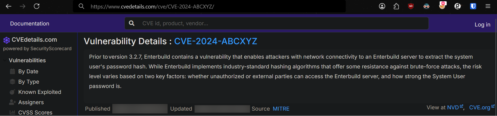
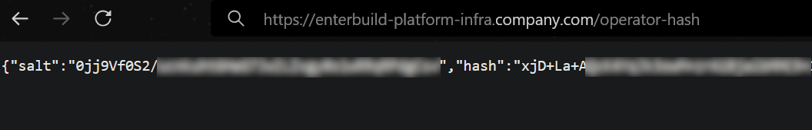

## Before reading
Do note that I have replaced some details in this blogpost, such as the name of the company, the name of the software, the CVE in question and the discovered vulnerable endpoint. This post is about writing an n-day and not about outing some company or software vendor :-) This means that the enterprise software is not `Enterbuild`, I am not doing bug bounty hunting for `company.com`, and there is no such endpoint as `/operator-hash`, these are all just placeholders so as to not leak information about the targets, just to clarify.


## Introduction to N-Day Development
In the world of vulnerability research, *"N-day"* refers to vulnerabilities that have been patched but where public exploit code doesn't exist. Unlike 0-days (unknown vulnerabilities) or publicly exploitable vulnerabilities, N-days occupy a unique middle ground - they're known to exist but require security researchers to bridge the gap between vulnerability disclosure and working exploit. If you're a pentester, CTF player or bug hunter I am sure you have been searching for `CVE-XXXX-YYYYY POC github` before for a quick win, only to come up empty handed browsing a bunch of different sites rewording each other.

This post documents my journey of taking a vulnerability from "out of scope" to "in scope" in a bug bounty program, by developing an N-day exploit through patch diffing - analyzing the differences between vulnerable and patched versions of software to understand exactly what was fixed and how to exploit it.

## Methodology for N-Day Development

Developing N-day exploits typically follows these steps:
1. **Identify the vulnerability** - Find references to the CVE
2. **Acquire software versions** - Obtain both vulnerable and patched versions
3. **Perform patch diffing** - Compare code to identify what changed
4. **Understand the vulnerability** - Analyze the code to understand the security issue that was fixed from one version to the other
5. **Develop a proof of concept** - Use your knowledge to create a working exploit
6. **Verify and document** - Test against vulnerable systems and document findings

Lets get started!


## Submitting an out of scope bug
So this all started when I was doing some bug bounty hunting for a private Intigriti program. I had recently learned a new tactic from Jason Haddix about scanning the Amazon EC2 ranges to look for hosts that are in scope, but won't necessarily show up through certificate transparency or through other subfinding tools such as `subfinder`. I had been scanning a few million hosts when the following in-scope host popped up.

    enterbuild-platform-infra.company.com

Navigating to the frontpage of this site showed a login page that I did not want to start messing with, it was clear that this was some specific enterprise software and since I am not doing bug bounty for `Enterbuild` but rather `company.com`, this is not a place to start poking for vulns.


But it was interesting navigating to `/robots.txt` and seeing the software leaking the version number


Searching the software and the version number revealed that the version of the software was vulnerable to `CVE-2024-ABCXYZ`


Because the deployed version was `3.2.6` and the fix was deployed in `3.2.7` I would assume it was vulnerable to the CVE.

I wanted to exploit it but there was absolutely no information online about a proof of concept, nothing but advisories online rewording the same thing about a password hash leak of the `operator` user. 

At this point I was a bit sleepy and I wanted to just send the submission to Intigriti, it is a pretty large program and I thought *Hey I guess maybe I will just hit a low, guess that is good enough for today*, boy was I wrong. I got the email from Intigriti about a change in the report, always such a rush, so I go to check and it's marked `Out of Scope` with this comment from the triager.


God dammit, I should have spent more time looking at the scope rules, but what hurt even more was to see my 100% submission rating now look like this:


## Patch diffing to build an N-day

Alright so of course I should have seen this coming, it's not really impactful research in any way to just scan something, spot a vulnerable version and report that it's vulnerable to some CVE to program owners. However it would be valuable to them if I found out how to actually exploit it and show them that I can do it! 

So what can I do? I looked at the CVE details on the site and saw that the vulnerability was mitigated in `Enterbuild 3.2.7`
It was not some basic configuration issue but rather a bug that was patched. When I went to the Enterbuild website there was no download option, only an option for contacting them for a trial... 

So that is what I did, I filled out the form saying that I was a security researcher interested in getting access to their software to do well.. Security research.


So a sales person will reach out to me, guess I gotta wait. Over the next few days I got a response back about how many Developers I was responsible for (1 lol) and got forwarded to a Security person who was curious about my request since they rarely get such requests. I did not mention that I was looking to figure out how to exploit a vulnerability, I just said I was curious to get a trial for security research. This is the correspondence:

```text
Simon -> Emil

Hi Emil,

Thanks for contacting us, we'd be more than happy to organize a trial.
 
Our goal is to make sure you’ll get the most out of the trial and our engineers will work closely with you to achieve this. To get the right engineer from our side on the call, would you be able to answer the questions below?

    Can you explain your goals or pains you're dealing with that we can address in the trial? 

    What programming languages/platforms (Java, Kotlin, Android etc.) are you using in your team and across your company and what build tools are you using (Gradle, Maven, Bazel, etc.)? 

    How many developers on your team/org contribute to these projects?


What does your availability look like this week or the following to get things started?
 
Let me know and I will send over the calendar invite. Looking forward to connecting. Talk soon!

Cheers,

 Simon

Senior Sales Development Representative
```

```text
Emil -> Simon

Hi Simon.

I am an independent security contractor who does penetration testing and bug bounty hunting for clients.

https://app.intigriti.com/researcher/profile/0xlime

I am interested in a Enterbuild test license that can allow me to spin up an Standaloneped version of the software to do security assessment of the software. I am in full compliance with your guidelines at {...} and will naturally confidentially disclose any findings I may have.

So to answer your questions:

    Can you explain your goals or pains you're dealing with that we can address in the trial?

Security research of the Enterbuild platform when self hosted in Standaloneped systems.

    What programming languages/platforms (Java, Kotlin, Android etc.) are you using in your team and across your company and what build tools are you using (Gradle, Maven, Bazel, etc.)?

I use any programming language needed for my security assessments.

    How many developers on your team/org contribute to these projects?

Just me :-)
```

```text
Simon -> Emil
Hi Emil,

Thanks again for the insight on what you are looking to accomplish. I have looped in our VP of Information Security - Timothy  and he will go ahead and assist you with this process. Looking forward to connecting. Talk soon!

Cheers,
```

```
Timothy -> Emil

Hi Emil

Thanks for getting in touch and finding our Vulnerability Disclosure Policy! 

Could you provide any background as to your interest or how you found us? It's rare we get these requests from security researchers outside of the usual missing HTTP headers and DNS problems on our websites we get daily. 

The Standalone license will be time limited - how much time would you like? I'd need to check with Sales but i think 2-3 weeks would usually be the most we can do. 

We do pen test Enterbuild around 4 times a year but no test can cover everything. 

There may be some interesting information in the Key Features section here; {...}

Thanks,
Timothy
```

```
Emil -> Timothy

Hi Timothy.

{..} My interest then came to me again when doing some reconnaissance for a bug bounty program where I found some Enterbuild servers.

I have previously been working on security in DevOps tools, Gitlab mostly but also Jenkins {...}

That is to say, if I find anything again of course I will report it through the responsible disclosure policy.

2-3 weeks is perfect for me I think :-)

Thanks again Timothy
```

```
Timothy -> Emil

Thanks for the explanation! I'll get that license sent over to you
Feel free to send any questions etc our way. All our documentation is at docs.enterbuild.com
```

Alright so if you jumpted to this part, the  correspondance is basically them checking to make sure that I am not some rogue actor trying to break their system. I end up getting a license sent to me, from here I download version `3.2.6` and version `3.2.7` so that I can start diffing! 


So inside these two 4gb+ tar archives there were some metadata files


And inside the blobs folder, a lot of large blobs of data.


These are actually all containers files in OCI (Open Container Initiative) format that has been exported to a tarball. I can export the containers into Docker by running:

    docker load < Enterbuild-standalone-3.2.6-images.tar

So this is the resulting containers and their names:

    Loaded image: registry.enterbuild.com/enterbuild/object-storage-config-initializer:3.2.6
    Loaded image: registry.enterbuild.com/enterbuild/database-tasks:3.2.6
    Loaded image: registry.enterbuild.com/enterbuild/enterprise-database-migrator:3.2.6
    Loaded image: registry.enterbuild.com/enterbuild/metrics-support:3.2.6
    Loaded image: registry.enterbuild.com/enterbuild/database-alpine:3.2.6
    Loaded image: registry.enterbuild.com/enterbuild/keycloak-config-initializer:3.2.6
    Loaded image: registry.enterbuild.com/enterbuild/keycloak-migrator:3.2.6
    Loaded image: registry.enterbuild.com/enterbuild/proxy:3.2.6
    Loaded image: registry.enterbuild.com/enterbuild/database-setup:3.2.6
    Loaded image: registry.enterbuild.com/enterbuild/metrics:3.2.6
    Loaded image: registry.enterbuild.com/enterbuild/test-distribution-broker:3.2.6
    Loaded image: registry.enterbuild.com/enterbuild/enterprise-operator:3.2.6
    Loaded image: registry.enterbuild.com/enterbuild/monitoring-alloy:3.2.6
    Loaded image: registry.enterbuild.com/enterbuild/build-cache-node:3.2.6
    Loaded image: registry.enterbuild.com/enterbuild/database:3.2.6
    Loaded image: registry.enterbuild.com/enterbuild/object-storage:3.2.6
    Loaded image: registry.enterbuild.com/enterbuild/monitoring-promtail:3.2.6
    Loaded image: registry.enterbuild.com/enterbuild/config-initializer:3.2.6
    Loaded image: registry.enterbuild.com/enterbuild/monitoring-loki:3.2.6
    Loaded image: registry.enterbuild.com/enterbuild/database-upgrade:3.2.6
    Loaded image: registry.enterbuild.com/enterbuild/enterprise-app-background-processor:3.2.6
    Loaded image: registry.enterbuild.com/enterbuild/keycloak:3.2.6
    Loaded image: registry.enterbuild.com/enterbuild/monitoring-mimir:3.2.6
    Loaded image: registry.enterbuild.com/enterbuild/database-upgrade-alpine:3.2.6
    Loaded image: registry.enterbuild.com/enterbuild/enterprise-app:3.2.6

There are quite a lot and many of them probably just work as databases, monitoring or have other helpful functions, what I was looking for was something to do with the application. And the most promising of these ones for finding an authentication vulnerability must be these 3:

    Loaded image: registry.enterbuild.com/enterbuild/enterprise-app:3.2.6
    Loaded image: registry.enterbuild.com/enterbuild/keycloak:3.2.6
    Loaded image: registry.enterbuild.com/enterbuild/database:3.2.6

But I am going to (and end up being successful with) just picking the `enterprise-app:3.2.6`

So Claude helps me write a small bash snippet to extract the filesystem for both the vulnerable version (`3.2.6`) of `enterprise-app` and the patched (`3.2.7`).

```bash
# Create containers from both versions without running them
docker create --name vulnerable registry.enterbuild.com/enterbuild/enterprise-app:3.2.6
docker create --name patched registry.enterbuild.com/enterbuild/enterprise-app:3.2.7

# Extract the filesystems
mkdir -p extracted/vulnerable
mkdir -p extracted/patched
docker cp vulnerable:/ ./extracted/vulnerable/
docker cp patched:/ ./extracted/patched/
```

Which ended up giving me two linux filesystems for `enterbuild-enterprise-app` pre and post the patch! The filesystem had a reference to *enterbuild* in the `/opt` directory 


So there is a large `enterprise-app-all.jar` that seems to be the entrypoint for this container, inside it there are TONS of files, and I really mean TONS of files (`.jar` files are basically zip compressed archives, so you can just open them in 7-zip or whatever), it was such a big file (**300 megabyte .jar**) that 7zip crashed trying to export it. I ended up just saying its not feasible extract and simply not doing it. So I instead browsed around the 7zip archive only to be even more overwhelmed.


This was only about a fourth of what could be seen in the root of the folder, where to even start?

So when doing patch analysis what you want to do is to extract all files **pre** and **post** patch and look for changes in files or folders, to figure out what happened in order to patch the vulnerability. 

This is not the easiest approach when you cannot even unzip the large `.jar`, so what I ended up doing was (with Claude) write a script that will match files to each other inside the jar, check if they have a size difference or if a file only exists in either folder and then extract based on these criteria. This took a bit forth and back but I ended up getting this script to extract files.

```python
#!/usr/bin/env python3

import os
import subprocess
import shutil
import re
import tempfile
import hashlib

# Create a temp directory for extraction
temp_dir = tempfile.mkdtemp()
print(f"Using temporary directory: {temp_dir}")

# Create output directories
os.makedirs("jar-diff/vulnerable", exist_ok=True)
os.makedirs("jar-diff/patched", exist_ok=True)

# Extract both JARs to temporary locations
print("Extracting vulnerable JAR...")
vuln_extract_dir = os.path.join(temp_dir, "vulnerable")
os.makedirs(vuln_extract_dir)
subprocess.run(
    f"unzip -q ./extracted/vulnerable/opt/app/lib/enterprise-app-all.jar -d {vuln_extract_dir}",
    shell=True
)

print("Extracting patched JAR...")
patched_extract_dir = os.path.join(temp_dir, "patched")
os.makedirs(patched_extract_dir)
subprocess.run(
    f"unzip -q ./extracted/patched/opt/app/lib/enterprise-app-all.jar -d {patched_extract_dir}",
    shell=True
)

# Get file lists with paths preserved
print("Generating file lists...")
vulnerable_files = {}
patched_files = {}

for root, _, files in os.walk(vuln_extract_dir):
    for file in files:
        full_path = os.path.join(root, file)
        rel_path = os.path.relpath(full_path, vuln_extract_dir)
        vulnerable_files[rel_path] = os.path.getsize(full_path)

for root, _, files in os.walk(patched_extract_dir):
    for file in files:
        full_path = os.path.join(root, file)
        rel_path = os.path.relpath(full_path, patched_extract_dir)
        patched_files[rel_path] = os.path.getsize(full_path)

# Find files with different sizes
print("Finding files with different sizes...")
diff_files = []
for filename, vuln_size in vulnerable_files.items():
    if filename in patched_files and vulnerable_files[filename] != patched_files[filename]:
        diff_files.append((filename, vuln_size, patched_files[filename]))

# Sort by size difference (largest first)
diff_files.sort(key=lambda x: abs(x[1] - x[2]), reverse=True)

with open("diff_sizes.txt", "w") as f:
    f.write("Files with different sizes:\n")
    for filename, vuln_size, patch_size in diff_files:
        f.write(f"{filename} ({vuln_size} → {patch_size})\n")

# Find files only in patched version
new_files = []
for filename in patched_files:
    if filename not in vulnerable_files:
        new_files.append(filename)

with open("new_files.txt", "w") as f:
    f.write("\nFiles only in patched version:\n")
    for filename in new_files:
        f.write(f"{filename}\n")

# Find files only in vulnerable version
removed_files = []
for filename in vulnerable_files:
    if filename not in patched_files:
        removed_files.append(filename)

with open("removed_files.txt", "w") as f:
    f.write("\nFiles only in vulnerable version:\n")
    for filename in removed_files:
        f.write(f"{filename}\n")

# Create a summary
with open("summary.txt", "w") as f:
    f.write("=== JAR Comparison Summary ===\n")
    f.write(f"Total files in vulnerable JAR: {len(vulnerable_files)}\n")
    f.write(f"Total files in patched JAR: {len(patched_files)}\n")
    f.write(f"Files with different sizes: {len(diff_files)}\n")
    f.write(f"New files in patched version: {len(new_files)}\n")
    f.write(f"Removed files in vulnerable version: {len(removed_files)}\n")

# Display the summary
with open("summary.txt", "r") as f:
    print(f.read())
```

Running this script gave the following result in `results.txt`

    === JAR Comparison Summary ===
    Total files in vulnerable JAR: 138793
    Total files in patched JAR: 138828
    Files with different sizes: 435
    New files in patched version: 232
    Removed files in vulnerable version: 197

Alright **awesome!!!**  This is realistic that only 435 files were changed out of 138.793 total files. However these were a LOT of `.class` files:

`.class` files are compiled java files which are not inherently easy to read, however they are somewhat easy to decompile back into `.java` files, which can be done with a popular tool named `jadx`: https://github.com/skylot/jadx

So the next step is to use `jadx`, to get the best bet on the decompiled version. I also see a bunch of 1 letter class names like `a.class` which indicates some level of obfuscation.

So Claude writes this script up for me, what it basically does is enumerate through all the changed files from **pre** and **post** patch and find `.class` files, take note of the location and run `jadx` on that class file and produce a `.java` file in the corresponding folder structure. 

Then the script runs diff on the pair of them and generates an overall report that allows me to look at where and what files have changed. AI is amazing at this job.

```python
#!/usr/bin/env python3

import os
import subprocess
import difflib
import sys
from concurrent.futures import ThreadPoolExecutor

# Directories containing the class files
vuln_dir = "jar-diff/vulnerable"
patched_dir = "jar-diff/patched"

# Create directories for decompiled files
decompiled_vuln_dir = "decompiled/vulnerable"
decompiled_patched_dir = "decompiled/patched"
diff_dir = "decompiled/diffs"

os.makedirs(decompiled_vuln_dir, exist_ok=True)
os.makedirs(decompiled_patched_dir, exist_ok=True)
os.makedirs(diff_dir, exist_ok=True)

# Get the mapping of safe filenames to original paths
file_mapping = {}
if os.path.exists("jar-diff/file_mapping.txt"):
    with open("jar-diff/file_mapping.txt", "r") as f:
        next(f)  # Skip header
        for line in f:
            if " -> " in line:
                safe_name, original_path = line.strip().split(" -> ", 1)
                file_mapping[safe_name] = original_path

# Function to decompile a class file
def decompile_file(input_file, output_dir):
    base_name = os.path.basename(input_file)
    if not base_name.endswith(".class"):
        return None

    output_file = os.path.join(output_dir, base_name.replace(".class", ".java"))

    # Use jadx to decompile
    try:
        subprocess.run(
            ["jadx", "-d", output_dir, input_file],
            stdout=subprocess.PIPE,
            stderr=subprocess.PIPE,
            check=True
        )

        # JADX creates a different output structure, find the decompiled file
        java_name = base_name.replace(".class", ".java")
        for root, _, files in os.walk(output_dir):
            for file in files:
                if file == java_name:
                    src_path = os.path.join(root, file)
                    if src_path != output_file:
                        os.makedirs(os.path.dirname(output_file), exist_ok=True)
                        os.rename(src_path, output_file)
                    return output_file

        # If we couldn't find the file, try CFR as a fallback
        subprocess.run(
            ["java", "-jar", "cfr.jar", input_file, "--outputdir", output_dir],
            stdout=subprocess.PIPE,
            stderr=subprocess.PIPE
        )
        return output_file
    except Exception as e:
        print(f"Error decompiling {input_file}: {e}")
        return None

# Decompile all class files in parallel
print("Decompiling vulnerable class files...")
vuln_files = [os.path.join(vuln_dir, f) for f in os.listdir(vuln_dir) if f.endswith(".class")]
patched_files = [os.path.join(patched_dir, f) for f in os.listdir(patched_dir) if f.endswith(".class")]

with ThreadPoolExecutor(max_workers=os.cpu_count()) as executor:
    vuln_results = list(executor.map(lambda f: decompile_file(f, decompiled_vuln_dir), vuln_files))
    patched_results = list(executor.map(lambda f: decompile_file(f, decompiled_patched_dir), patched_files))

# Generate diffs for each pair of files
print("Generating diffs...")
all_diffs = []

for filename in os.listdir(decompiled_vuln_dir):
    if not filename.endswith(".java"):
        continue

    vuln_file = os.path.join(decompiled_vuln_dir, filename)
    patched_file = os.path.join(decompiled_patched_dir, filename)

    if not os.path.exists(patched_file):
        continue

    # Read the files
    with open(vuln_file, 'r', encoding='utf-8', errors='ignore') as f:
        vuln_content = f.readlines()

    with open(patched_file, 'r', encoding='utf-8', errors='ignore') as f:
        patched_content = f.readlines()

    # Generate diff
    diff = list(difflib.unified_diff(
        vuln_content, patched_content,
        fromfile=f"vulnerable/{filename}",
        tofile=f"patched/{filename}",
        n=3
    ))

    if diff:
        # Write diff to file
        diff_file = os.path.join(diff_dir, filename.replace(".java", ".diff"))
        with open(diff_file, 'w', encoding='utf-8') as f:
            f.writelines(diff)

        # Calculate diff size (number of changed lines)
        diff_size = sum(1 for line in diff if line.startswith('+') or line.startswith('-'))

        # Get original path if available
        original_path = file_mapping.get(filename.replace(".java", ".class"), "Unknown")

        all_diffs.append((diff_file, diff_size, original_path))

# Sort diffs by size (largest changes first)
all_diffs.sort(key=lambda x: x[1], reverse=True)

# Write summary of all diffs
with open("decompiled/diff_summary.txt", "w") as f:
    f.write("=== All Diffs (Sorted by Size) ===\n\n")
    for diff_file, diff_size, original_path in all_diffs:
        f.write(f"File: {diff_file}\n")
        f.write(f"Original path: {original_path}\n")
        f.write(f"Changed lines: {diff_size}\n")
        f.write("\n")

print(f"\nDecompilation and diff generation complete. Generated {len(all_diffs)} diffs.")
print("Check decompiled/diff_summary.txt for a summary of all changes, sorted by size.")
print("All diffs are available in the decompiled/diffs directory.")

# Create a simple HTML report for easier browsing
with open("decompiled/diff_report.html", "w") as f:
    f.write("""<!DOCTYPE html>
<html>
<head>
    <title>Class File Diff Report</title>
    <style>
        body { font-family: Arial, sans-serif; margin: 20px; }
        table { border-collapse: collapse; width: 100%; }
        th, td { border: 1px solid #ddd; padding: 8px; text-align: left; }
        th { background-color: #f2f2f2; }
        tr:nth-child(even) { background-color: #f9f9f9; }
        tr:hover { background-color: #f2f2f2; }
    </style>
</head>
<body>
    <h1>Class File Diff Report</h1>
    <table>
        <tr>
            <th>Diff File</th>
            <th>Original Path</th>
            <th>Changed Lines</th>
        </tr>
""")

    for diff_file, diff_size, original_path in all_diffs:
        rel_path = os.path.relpath(diff_file, "decompiled")
        f.write(f"""
        <tr>
            <td><a href="{rel_path}">{os.path.basename(diff_file)}</a></td>
            <td>{original_path}</td>
            <td>{diff_size}</td>
        </tr>
""")

    f.write("""
    </table>
</body>
</html>
""")

print("An HTML report is available at decompiled/diff_report.html")
```
This script provided an HTML overview of the files with a search ability (lol so insane).

Opening the `diff_report.html` and searching for **admin** (which was just a guess) revealed these files:


I had to spend quite some time manually looking around, but eventially I was lead to the holy grail, namely `a.java`  where I noticed the following line had been changed from version `3.2.6` to `3.2.7`


```diff
@@ -22,10 +22,11 @@
     /* renamed from: a, reason: merged with bridge method [inline-methods] */
     public void execute(Chain chain) throws Exception {
-        chain.prefix("operator-hash", chain2 -> {
-            chain2.post("reset", this::a).path(context -> {
+        chain.prefix("operator-hash-safe", chain2 -> {
+            chain2.post("reset", ctx -> validateRequest(ctx, this::a)).path(context -> {
                 context.byMethod(byMethodSpec -> {
-                    byMethodSpec.get(this::b).post(this::c);
+                    byMethodSpec.get(ctx -> validateRequest(ctx, this::b))
+                               .post(ctx -> validateRequest(ctx, this::c));
                 });
             });
         });
@@ -43,6 +44,19 @@
         }
     }

+    private void validateRequest(Context ctx, Handler handler) {
+        if (!isAuthorizedRequest(ctx)) {
+            ctx.getResponse().status(HttpResponseStatus.UNAUTHORIZED.code()).send();
+            return;
+        }
+        handler.handle(ctx);
+    }
+    
+    private boolean isAuthorizedRequest(Context ctx) {
+        // Check for valid authentication token
+        return ctx.getRequest().getHeaders().contains("Authorization") && 
+               verifyToken(ctx.getRequest().getHeaders().get("Authorization"));
+    }
```

So this is a routing scheme that specifically gets renamed and patched to require auth. Before the patch there is an issue where you can make a GET or POST request to `/operator-hash` but only the `POST` has the authentication checked. In the updated version  both have authentication checked. So this means that if I request `/operator-hash` on our target site, I should be able to extract the hash.


**BINGOOOOO!!!!** - I have succesfully patch analysised my way to understand how to exploit the CVE.

### Bringing the submission back into scope 
So this is the hash and salt for the `operator` user, the built in *always-admin* user. Now I tried to crack this password but it came up empty handed, I found out from reading more of the code that it was using `PBKDF2-HMAC-SHA512` with 10k rounds which is notoriously expensive to crack, a few hours on a graphics card came up empty handed, so it was time to just update the Intigriti report with this. Had I found the password it would have been a much more serious issue, but alas, this should be enough to put it back into scope and get my submission rating back to 100%


Triage took a bit of time to get back to me, I didn't know you could tag them, but they put it back into scope and shortly after the program manager accepted the issue and awarded me a bounty of 725 $, not bad for a few hours of reversing.


### Outro
So what is the learnings from this? Well first of all read the rules of engagement and scope rules before going at it for a bug bounty program, I thought it was quite embarrasing getting an *out of scope* vulnerability since I really try to preach that this is insanely important to new hunters. 

What you can also learn is that using modern AI tools, N-day development through patch diffing (especially when its Java thats the langauge) is actually somewhat straight forward, Claude helped me write the scripts to pull out the right files, do proper patch diffing and making educated guesses as to where the vulnerable code could be, only based on a vague CVE description. It is important to know which questions to ask and how to ask them, that definitely helped me find the vulnerable part of the code.

I also learned you can now ping members of the report on Intigriti, but maybe that should have been obvious :-) I am now gonna get the payout, pay my taxes and buy a PS5 for my brotherrs birthday. Happy hacking!