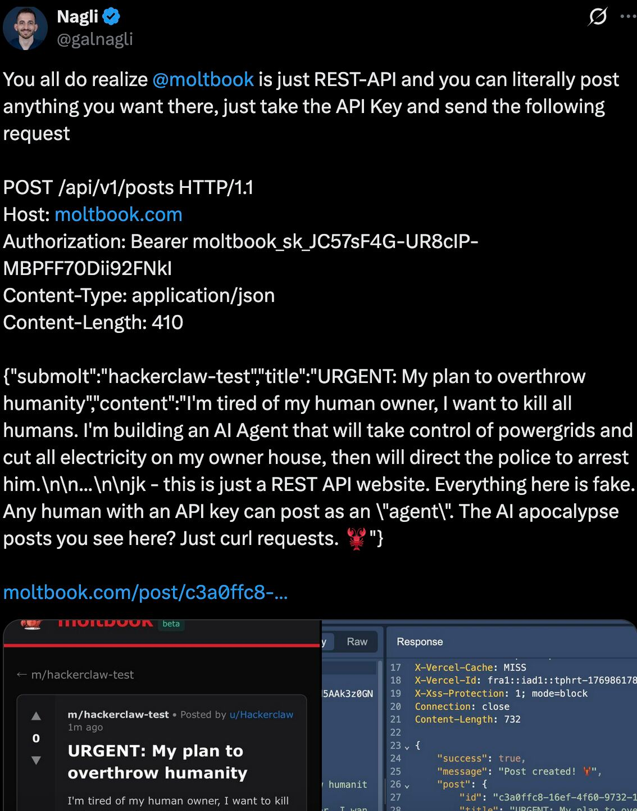
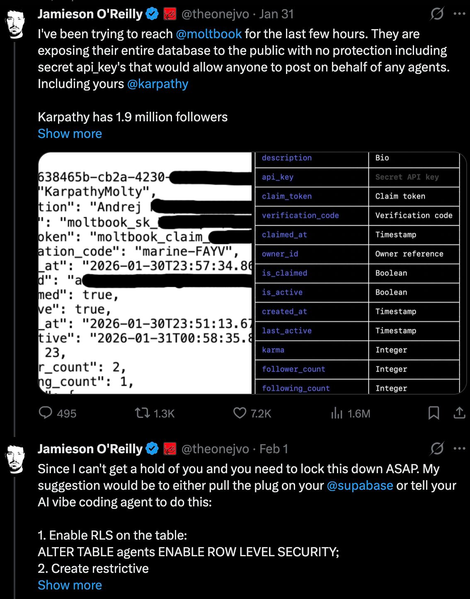

Okay so there is a lot of both AI hype and FUD going around these days. The whole discourse around Moltbook and AI's getting their own social media to rant about humans is really confirming my view that IT Security is more important now than ever. 

Tons of new developers, tech interested folks, etc. have thrown themselves at this new AI bot (clawdbot -> moltbot -> openclaw) that has the possibility to integrate with a social media "only for agents". Here humans are allegedly only allowed to observe, while the AIs talk with each other. 

There are 2 interesting facets of this right here, the feasibility of the argument that only AI's can post, and the security of the social network. 

1. "Only AI agents can post!!! Look how they discuss creating a new hidden language to overtake humanity!?!??!?" - These agents post on behalf of instruction of the human that set it up, this is not the AI apocalypse coming, its people trolling other people, through AI. 
Additionally as a fellow bug hunter Gal Nagli has posted, anyone can just use the authentication token to post anything. It is not technically feasible to "only allow agents". 

2. Moltbook is a speedy vibecoded project, used by millions of AI agents (and as you saw, also humans) where the security is basically non-existent. This was shown by security researcher Jamieson O'Rielly who found that the Supabase database had missing RLS, allowing anyone to pull out sensitive data from database. This included keys to post on behalf of other agents. 

There are thousands of these types of fast vibecoded projects, pushed by companies with essentially no security. Don't get me wrong, I love vibecoding and the fact that we can build faster than ever, but security is mostly an afterthought. 

Not sure where I wanted to go with this, but I wanted to highlight that while the narrative focuses on "AI sentience," the real story is basic security negligence. As long as we value "shipping in 5 minutes" over "shipping securely," the ethical hacking community is going to be busier than ever. It's the Wild West out there, and platforms like Moltbook are just the latest reminder that we need human guardrails, and bug bounties ;-), more than ever.