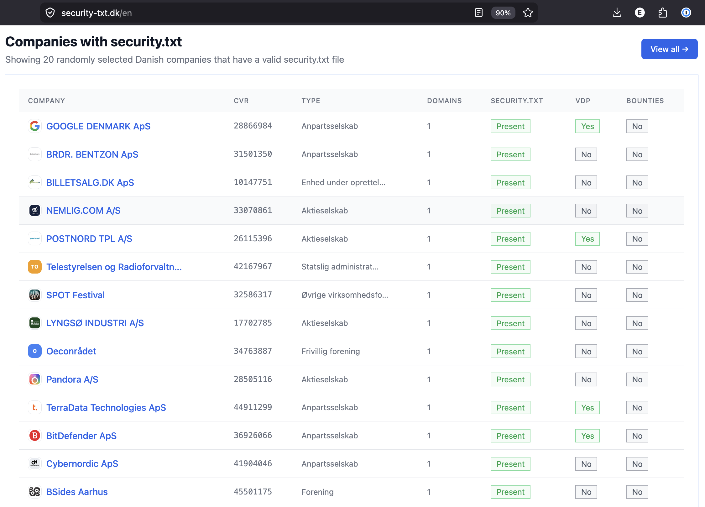
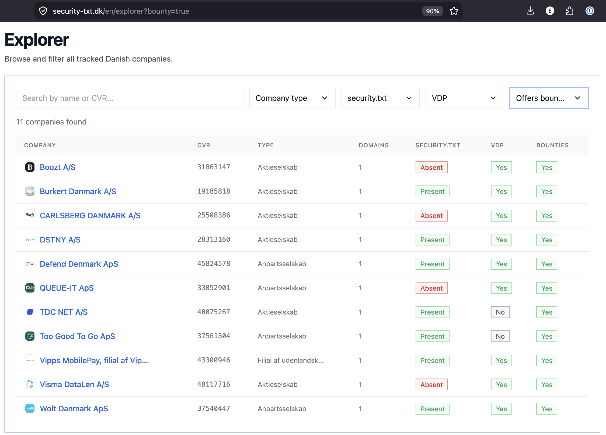

Since I did my research on .dk domains and security.txt, and with Claude Code superpowering my frontend skills (lol thank god), I wanted to build a dashboard to showcase how it's really going in Denmark.

So I took the data and made a site to track it: https://security-txt.dk/

Essentially I narrowed down around 30k Danish companies from the CVR register and tried to find their websites. Using that (with some false positives), I checked how many companies expose a security.txt and a VDP (Vulnerability Disclosure Policy).

And the short answer is: almost none. Of the ~28,000 companies I track, only 361 (1.3%) publish a valid security.txt, and just 185 (0.7%) have a VDP. Even among the ones that do bother, maintenance is rough, of the security.txt files that include an Expires field(required by RFC 9116), nearly half are already expired. So adoption isn't just rare, it's often stale.

The picture in the public sector is its own story. Denmark has exactly 98 municipalities and 5 regions, and I track all of them — yet only 7 of the 98 municipalities publish a security.txt, and just 5 of 138 state entities (3.6%). The institutions sitting on the most sensitive citizen data are some of the hardest to report a vulnerability to.

I think it makes more sense to track a company's adoption as opposed to individual domains. Not all domains are associated with a company, but all companies (or at least most) are associated with a domain. Additionally, when you want to report a vulnerability, it's in most cases to a company, not to a single domain.

The ~30,000 companies that I track are based on my talk from BSides Copenhagen 2025, where I attempted to figure out which companies have a VDP.

From a Bug Bounty perspective, I thought it was interesting to try to track which Danish companies you can hack for rewards 😎, currently only 9 of them advertise a bounty program in their security.txt.

Another similar project is the Norwegian Websecured, which also tracks this. We take a slightly different approach, but I want to highlight it as a good candidate for exploring this data: https://domains.websecured.io/advanced-search?domain.suffix=.dk&securityTxt.available=true — this is a more domain-first approach, whereas I took a company-first approach.