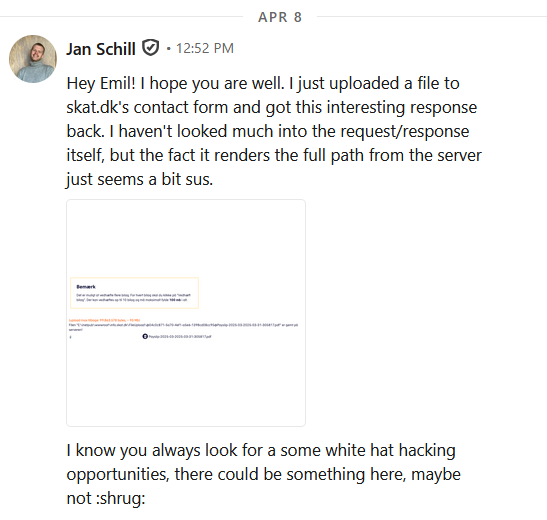
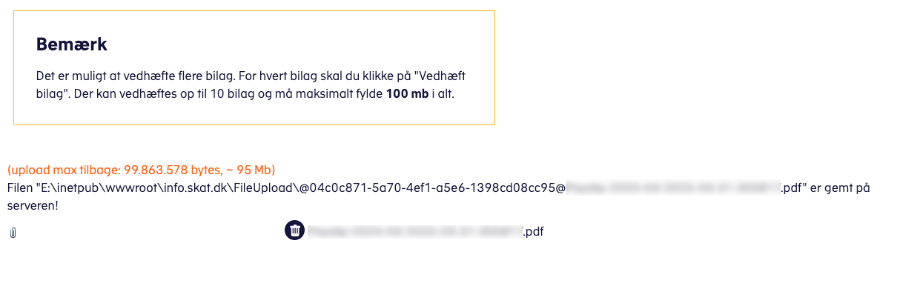
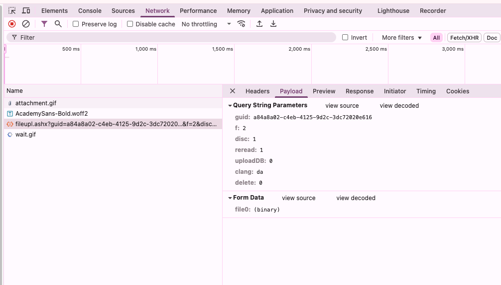
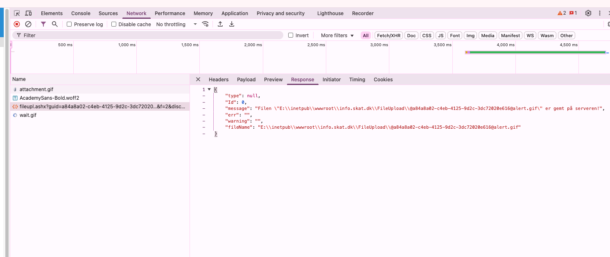
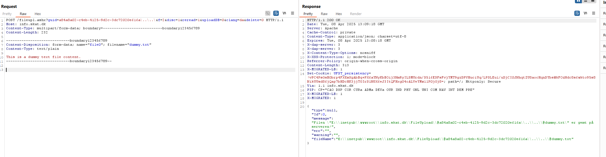
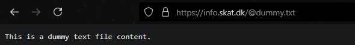
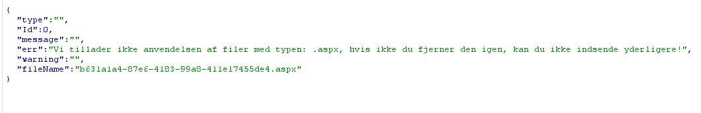
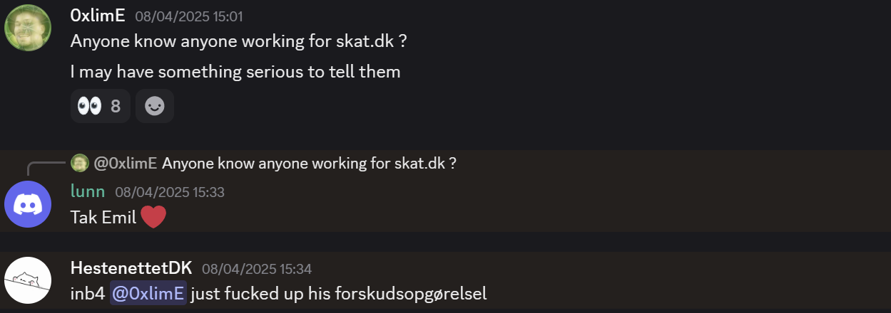

### Preface
I do not endorse performing unsolicited or unauthorized security testing of websites or systems. This article describes a situation where a friend shared an error message they encountered while legitimately using a service, which contained indicators suggesting a potential security vulnerability. Looking closer, this proved to be the case.

I want to emphasize that I do not actively seek vulnerabilities in systems where I lack explicit permission to test. However, when obvious security flaws are discovered through normal use or observation, I believe there is an ethical responsibility to report them responsibly to help improve overall security.

All findings discussed in this post were reported to SKAT through responsible disclosure channels prior to publication.

### Initial Discovery
Some time ago, my friend Jan reached out to me on LinkedIn. Presumably, he wrote to me because he saw my posts about security (yay) and thought that I would be interested in an error he got when he had to upload some files to info.skat.dk.



The error looked like this:



As Jan pointed out, it's not good practice to leak the full path of the file that you just uploaded. It's unnecessary information for the user at best, and at worst, it leaks information to malicious actors.

I asked Jan what the raw request had looked like, and he sent me this response:



What this shows is a POST request to https://info.skat.dk/fileupl.ashx, with query parameters `guid`, `f`, `disc`, `reread`, `uploadDB`, `clang`, and `delete`, with a file in a multipart form field (the filename is assumed from the multipart request).

Jan showed me the message he got on a successful upload:



What was interesting here is that the `guid` parameter was part of the path where the file was stored in the response message, with `@` signs prepended to both the filename and the GUID.

### Investigating to see if there is a vulnerability
I figured I would look at this more, since I thought it was just about time before someone else would stumble upon this. I didn't know which part of SKAT this was from—I had never myself had to upload anything—but I figured I would just try to send off an unauthenticated forged request. This allowed me to upload some random GIF file like the one Jan did.

However, I wondered if the GUID was actually validated to be a proper GUID, or if I could put whatever into the filename part. Could I choose any extension? 

The obvious thing to try was to use path traversal to walk out of the directory and up into the webroot, looking at the path given back:

    E:\\inetpub\\wwwroot\\info.skat.dk\\FileUpload\\@<some GUID>@<some filename>

The `inetpub\\wwwroot` is the standard IIS webroot, and the folder `info.skat.dk` tells me that this is for that hostname. Presumably, there are other hostnames on this server, but I did not investigate that. 

If I chose a GUID parameter with the name of `<guid>\..\..\`, I would probably be able to walk up into the webroot for `info.skat.dk`, and this is what I did with a dummy text file. This is called a **path traversal vulnerability**.



**Oh shit**, this indicates the file was put there in the webroot. Could I access it?



Okay, this is not SUPER bad, but it's pretty bad. I could, for example, upload an `.html` file and do some proper phishing, or even worse, upload an `.aspx` file to try to get code execution on the server. So I tried uploading a minimal execution example:


```aspx
<%@ Page Language="C#" %>
<%@ Import Namespace="System.Diagnostics" %>
<%@ Import Namespace="System.IO" %>

<script runat="server">
    protected void Page_Load(object sender, EventArgs e)
    {
        Process proc = new Process();
        proc.StartInfo.FileName = "cmd.exe";
        proc.StartInfo.Arguments = "/c whoami";
        proc.StartInfo.UseShellExecute = false;
        proc.StartInfo.RedirectStandardOutput = true;
        proc.Start();

        string output = proc.StandardOutput.ReadToEnd();
        proc.WaitForExit();

        Response.Write("<pre>" + Server.HtmlEncode(output) + "</pre>");
    }
</script>

<html>
<head>
    <title>Whoami Command Output</title>
</head>
<body>
    <h1>Output of 'whoami' command:</h1>
</body>
</html>
```

Which would simply run the `whoami` command. I edited the filename to be some random filename (so no one would find it) ending with `.aspx` and tried to upload it. This gave the following error:



Alright, this is good, but there are potentially hundreds of ways around it:
1. Setting an empty filename but using the `guid` parameter to set the `.aspx` extension
2. Adding a null byte after `.aspx` but before some known extension like `.jpg`
3. Case variation bypasses such as `file.AsPx`
4. Using semicolon separators: `file.asp;.jpg` or `payload.aspx;.png`

And I could go on... But at this point, it became a curious poke to an actual hacking attempt, and I had to remind myself not to get carried away. There was naturally a vulnerability present that I should alert them about.

### Responsible Disclosure
When wanting to get in touch with the security department of different organizations, you can check if they have a `security.txt`, either directly in the webroot or at `/.well-known/security.txt`. SKAT had neither. Additionally, searching for security did not bring up any relevant contacts really—kind of hard to know who to contact.

I don't know anyone who works for skat.dk, but thankfully I am part of **Kalmarunionen**, the CTF team, which is well connected, so I wrote in the Discord if someone knew who I could contact:



Thankfully *Lunn* got me a contact and set us up on Signal. I also included *HestenettetDK* shitposting because naturally that's part of it.

From here, I was very impressed with how seriously they took it. They asked for mine and Jan's IP so they could do an investigation to see if this was in any way abused. Shortly thereafter, I noticed that the `@dummy.txt` file was removed. I assume they have patched the endpoint now, but I did not go back to check since they didn't ask me to. 

### Outro
I think it's really important to let companies and institutions know if you find something in their tech that is vulnerable, but at the same time, you should not go out and about trying to test any system you come across. Additionally, I want to emphasize—not to come off as *holier-than-thou*—that in this scenario, it is not appropriate to ask for bounties or other forms of compensation. I mention this since I am an avid bug bounty hunter and usually do get compensated for this type of work, but in this context, this agreement was not established, especially since no vulnerability disclosure process was mentioned from SKAT's side.
