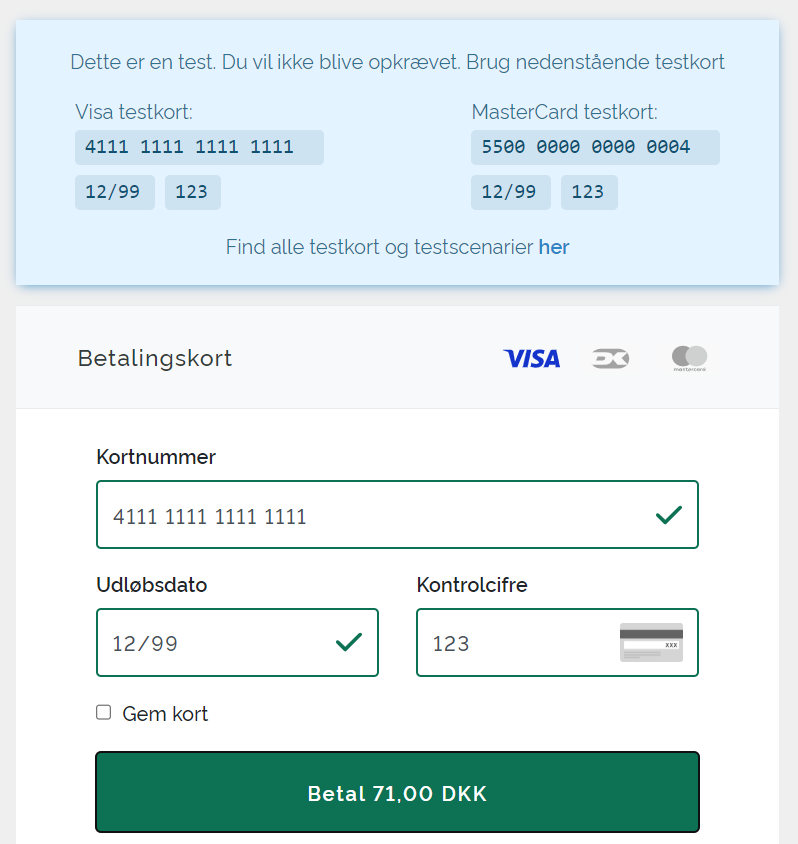
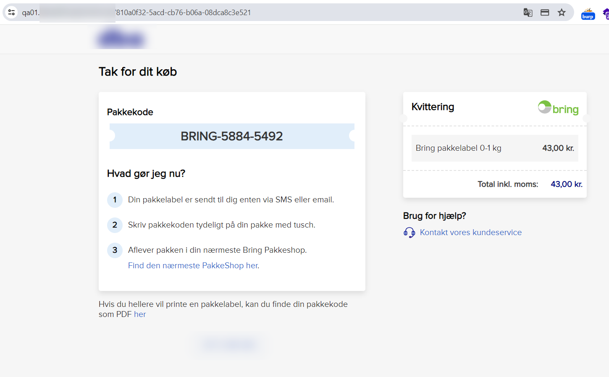
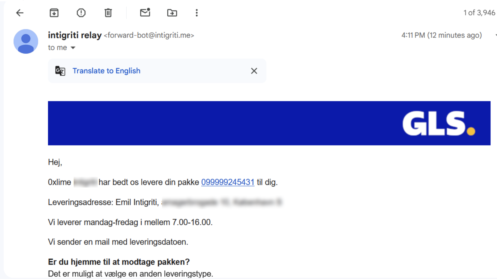
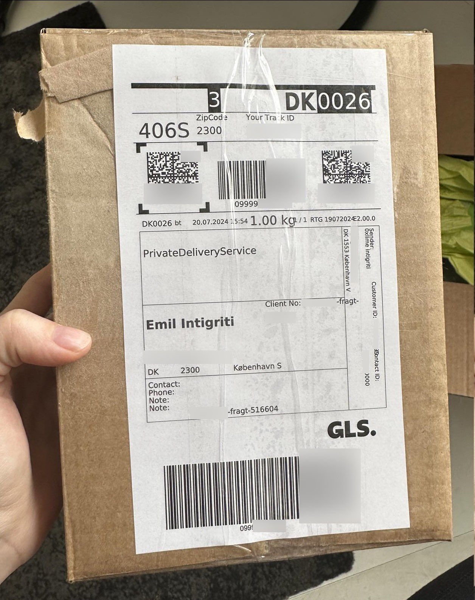
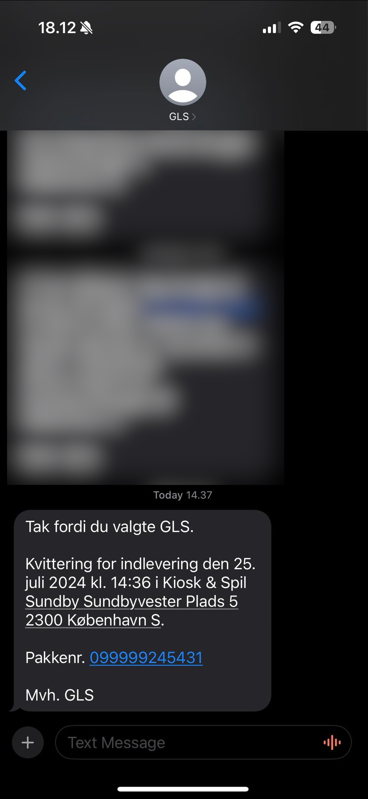
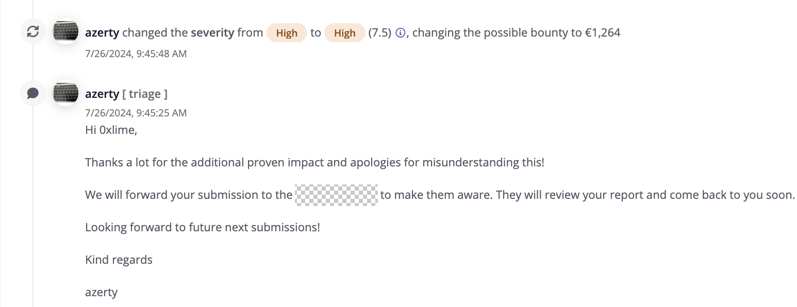
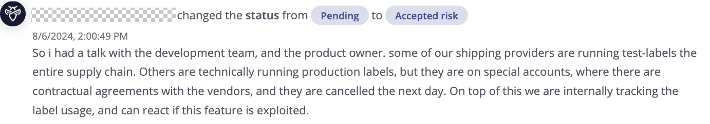

Recently I was doing Bug Bounty hunting on a private program that I really enjoy hacking on! It is a marketplace app that allows creating listings, sending messages and if you agree on a deal: buy package labels for quick shipping of that Pink Floyd record you sold for 39dkk ;-)

Anyway, the main app exists at https://marketplace-app.dk (cover of course), where going through the purchase flow of shipping labels worked pretty nice and was secure.

However there was also a subdomain for QA testing, at https://qa01.marketplace-app.dk/, a complete copy of the main app, just with testing data. I signed up for an account here and poked around, and tried to go through the flow of buying a package label and was greeted with this screen:

Alright sure, let me just try to put in the test credit card and see what happens. So I did this and actually got a checkout screen:

Doing the same with GLS, setting my own mail as the recipient, I actually got an email from GLS lol:

Triage did not really buy it initially, they said they thought this was just test labels and that there was no actual registry at GLS or the other logistics companies. So in order to hunt this bounty I actually went out and sent myself an empty package lol

I got a receipt on SMS that I handed in the package

So I waited a few days to pick up my own empty box and let the triage know, they understood it and changed the potential payout ;-)

So it went on to the customer who mentioned they wanted to investigate, but in bug bounty it does not always go the direction you want, and it was marked as an accepted risk, oh well!

